<h1 align="center">ALMAIDAH</h1>

<p align="center">
  <strong>Portal berita &amp; portal alumni Pesantren Darul Hikmah Sumedang.</strong><br>
  Satu tempat untuk kajian, kabar pesantren, dan data alumni — dengan alur redaksi yang jelas
  dan hak akses yang tidak bisa ditembus lewat menu.
</p>

<p align="center">
  
  
  
  
  
</p>

<p align="center">
  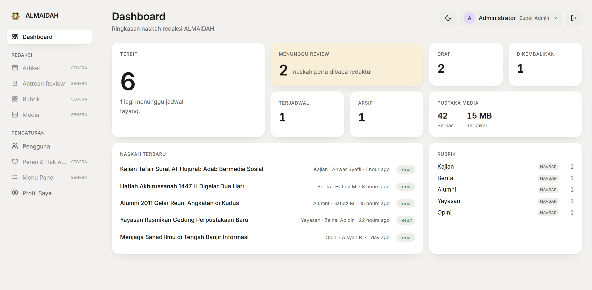
</p>

---

## Apa ini

Dua produk dalam satu aplikasi Laravel:

- **Portal berita.** Tujuh rubrik — Kajian, Berita, Alumni, Yayasan, Opini, Agenda, Video —
  dengan alur naskah bertingkat: penulis mengajukan, redaktur mereview, pemimpin redaksi
  menerbitkan atau menjadwalkan.
- **Portal alumni.** Setiap alumni punya akun: angkatan, riwayat mondok, kesibukan, dan
  domisili. Yang menulis dapat byline; yang tidak, tetap terdaftar sebagai anggota.

Bahasa panel memakai kata yang dikenal redaksi — *Naskah*, *Rubrik*, *Terbit* — bukan istilah sistem.

## Untuk siapa

| Peran | Yang bisa dilakukan |
| --- | --- |
| **Super Admin** | Semuanya, termasuk peran dan menu panel |
| **Pemimpin Redaksi** | Menerbitkan, menjadwalkan, mengarsipkan, mengelola pengguna |
| **Redaktur** | Mereview draf: menerima atau mengembalikan; menyunting semua artikel |
| **Penulis** | Menulis dan mengajukan draf sendiri, boleh menghapus miliknya |
| **Kontributor** | Menulis dan mengajukan draf sendiri, tanpa hak menghapus |
| **Anggota** | Alumni terdaftar yang tidak menulis — hanya membuka panel |

---

## Masuk tanpa email pun bisa

Alur dua tahap: identitas dulu, sandi kemudian. Kredensialnya boleh **email atau nomor HP** —
ratusan alumni hasil impor tidak punya alamat email, dan mereka tetap harus bisa masuk.

<p align="center">
  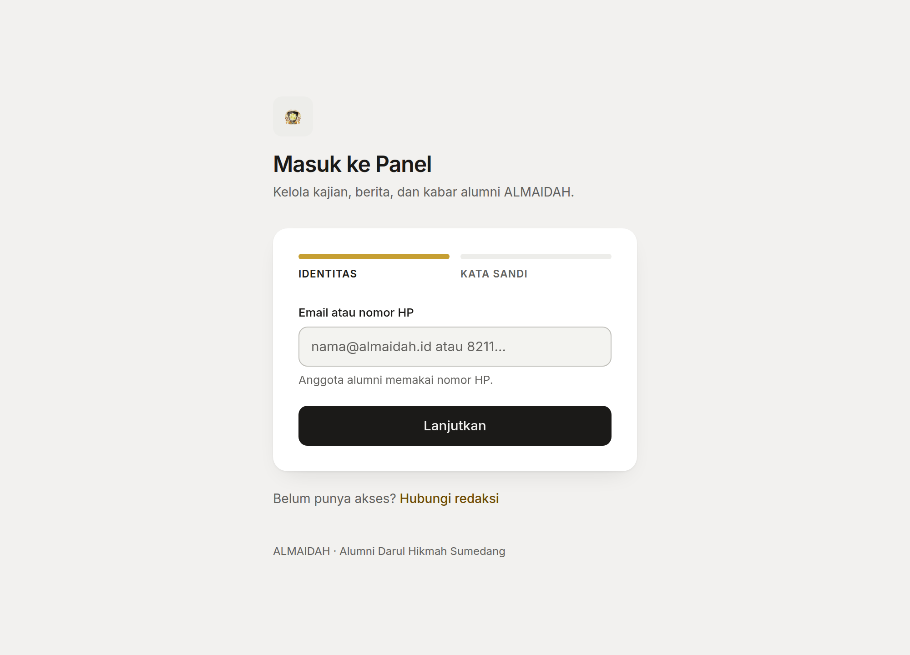
  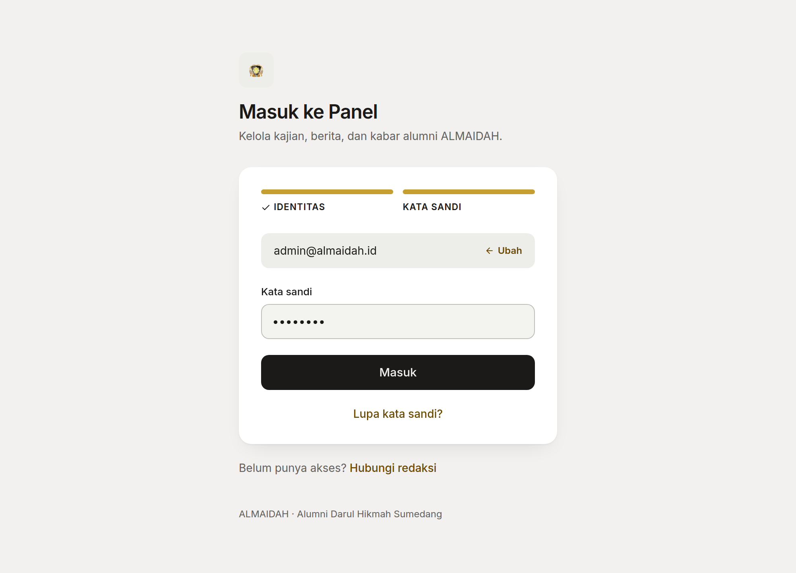
</p>

Nomor HP dibakukan sebelum dicocokkan, jadi `0821…`, `+62821…`, dan `821…` adalah satu orang,
bukan tiga. Endpoint pemeriksaan identitas dibatasi 10 percobaan per menit dan endpoint masuk
6 per menit — cukup untuk orang, terlalu sempit untuk menyisir daftar alamat.

Akun hasil impor ditandai wajib ganti sandi. Middleware menahannya di satu halaman sampai
sandi baru disetel, tanpa jalan memutar ke halaman lain.

<p align="center">
  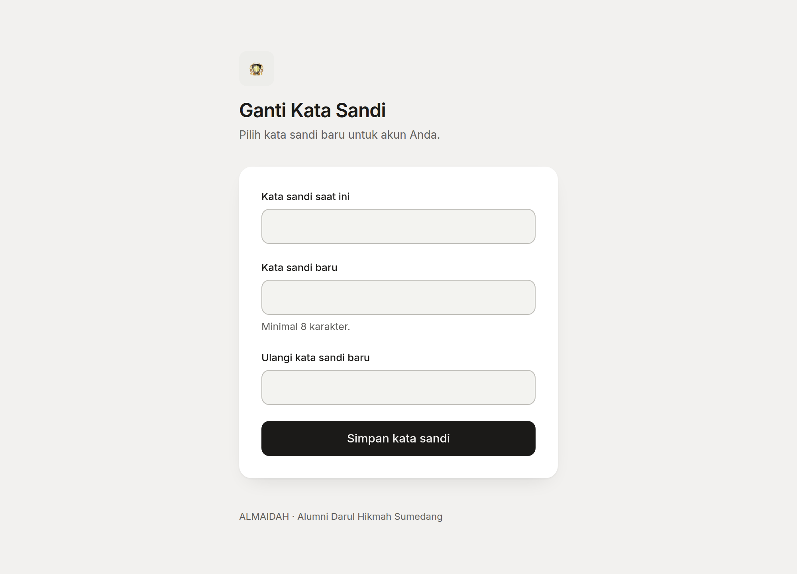
</p>

## Hak akses diambil dari peran aktif, bukan gabungan peran

Satu orang boleh memegang beberapa peran — misalnya Super Admin sekaligus Redaktur — tapi yang
menentukan hak akses hanya **peran yang sedang dipakai**. Pengalih peran ada di kartu identitas,
dan menu panel ikut berubah begitu peran diganti.

<p align="center">
  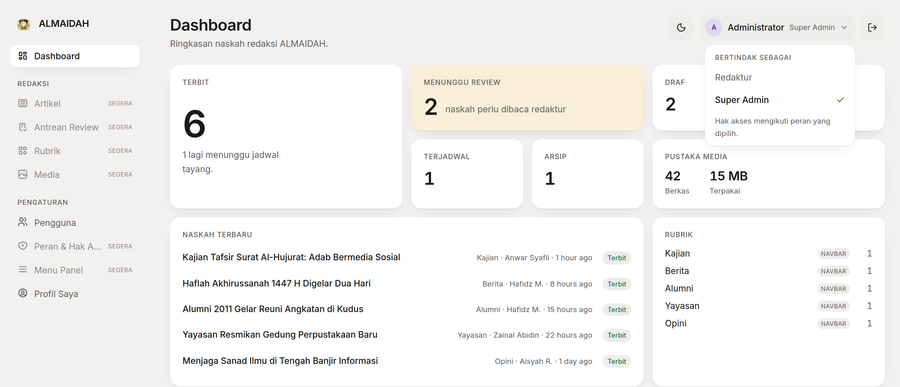
</p>

Menu panel disimpan di basis data dan ditautkan ke peran, bukan ditulis keras di kode. Item yang
tidak boleh dibuka tidak muncul — jadi tidak ada menu yang menyapa lalu menolak dengan 403.
Item induk tetap ditarik bila anaknya boleh dibuka, supaya tidak ada menu yatim.

## Pengguna: undang, sunting, nonaktifkan

Tidak ada pendaftaran publik. Pengguna baru diundang lewat email dan **menetapkan sandinya
sendiri** dari tautan undangan; sandi awalnya acak dan tidak pernah diberitahukan ke siapa pun.
Undangan bisa dikirim ulang bila tidak sampai.

<p align="center">
  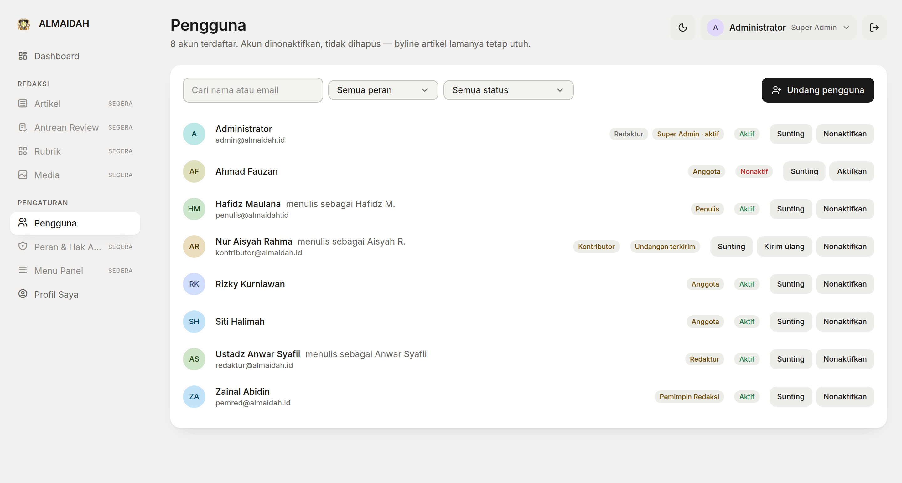
</p>

Akun **dinonaktifkan, tidak dihapus** — byline artikel lamanya tetap utuh. Daftar bisa disaring
per peran dan per status (aktif, nonaktif, undangan terkirim).

<p align="center">
  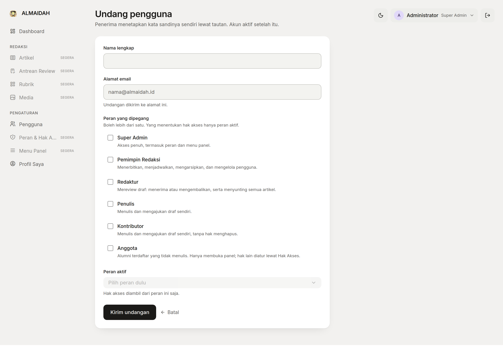
</p>

## Profil alumni sekaligus kartu penulis

Satu form memuat dua kebutuhan: data alumni untuk direktori, dan byline untuk halaman artikel.

- **Byline** — nama pena, gelar asatidz, bio singkat
- **Kontak publik** — email publik, Instagram, X
- **Riwayat pesantren** — tahun masuk dan angkatan (tahun keluar), status mondok
- **Kesibukan &amp; domisili** — pekerjaan, instansi, kota, provinsi

<p align="center">
  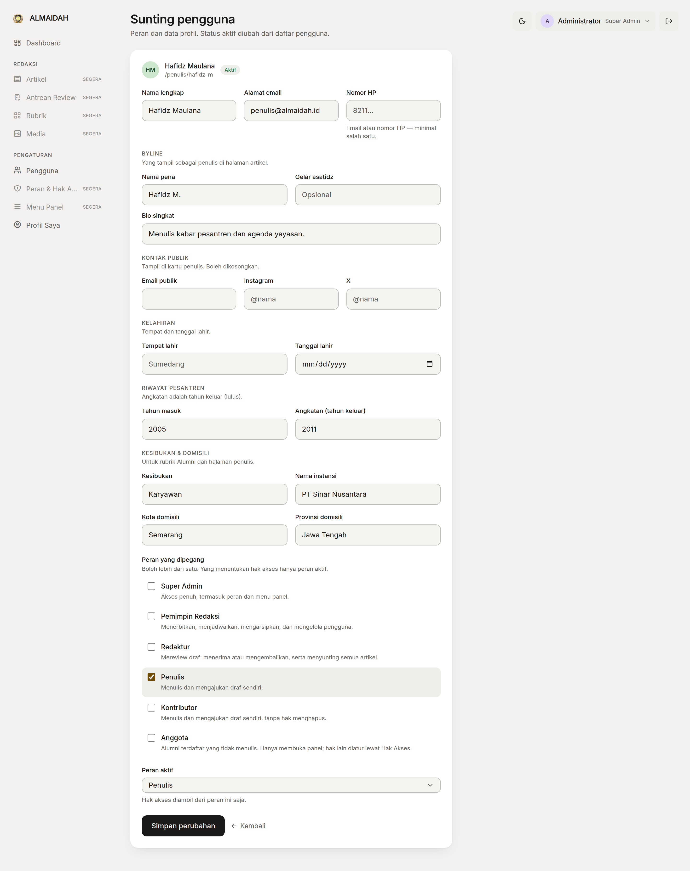
</p>

Slug profil dibentuk dari nama pena bila ada, dan tidak pernah bentrok dengan slug akun lain —
termasuk akun yang sudah dihapus lunak.

<p align="center">
  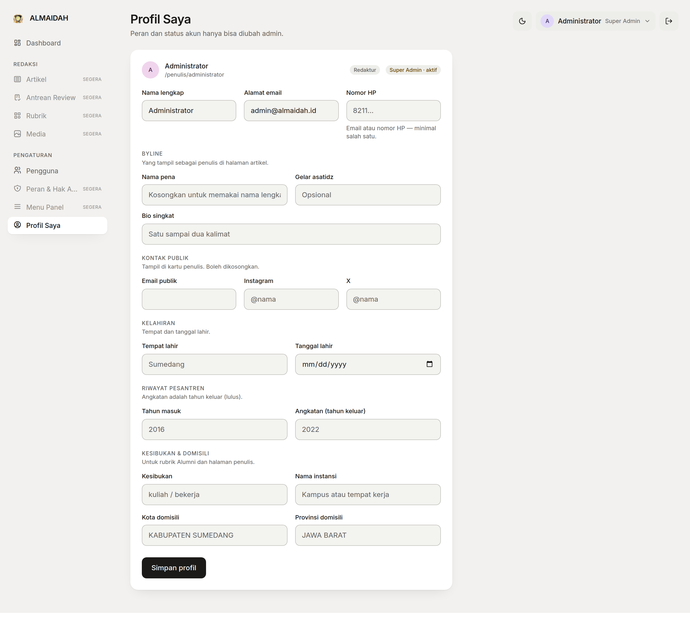
</p>

## Impor massal alumni dari CSV

Data alumni biasanya sudah ada di spreadsheet, dengan segala kekacauannya. Perintah impor
menanganinya, bukan menyerah padanya:

```bash
php artisan almaidah:import-alumni master-alumni.csv --dry-run   # lihat dulu
php artisan almaidah:import-alumni master-alumni.csv             # baru tulis
```

- Baris kembar (nama + tanggal lahir sama) digabung, yang pertama menang.
- Nomor HP kembar **dilewati** dan dilaporkan — lebih baik satu baris tertinggal daripada dua
  orang berbeda tergabung jadi satu akun.
- Nilai error spreadsheet (`#ERROR!`) dibuang jadi kosong, tidak masuk sebagai data.
- Sandi awal dibentuk dari tanggal lahir; kalau tanggalnya tidak masuk akal (lahir setelah masuk
  pesantren, umur di bawah 10 tahun) dipakai sandi cadangan dan jumlahnya dilaporkan.
- Semua akun hasil impor wajib ganti sandi saat pertama masuk.

Seluruh impor berjalan dalam satu transaksi: gagal di tengah berarti tidak ada yang tertulis.

## Desain yang punya aturan, bukan selera

Sistem token terkunci di [`design.md`](design.md): genre modern-minimal, varian **borderless** —
tidak ada satu pun garis di panel. Pemisahan dipikul beda warna dasar, bayangan, dan isian.
Warna dan radius selalu lewat nama token; nilai mentah tidak boleh muncul di komponen.

<p align="center">
  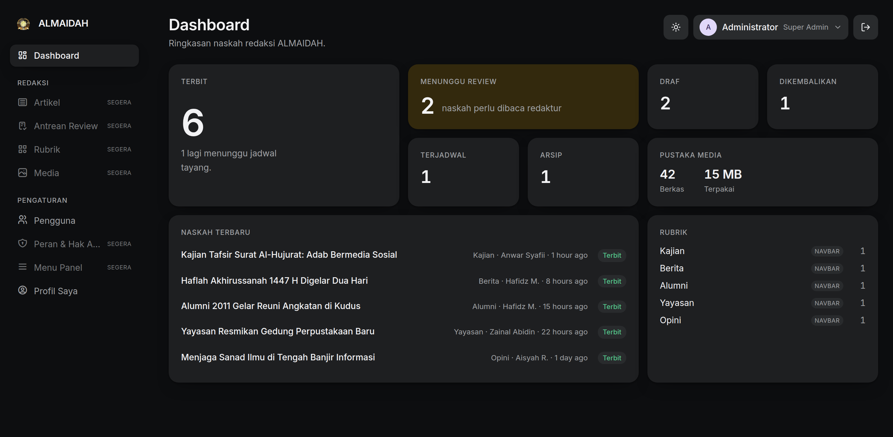
</p>

Aksen emas dipakai **sekali per layar**, hanya pada tile yang menuntut tindakan — pada dashboard
di atas: antrean review. Kontras teks minimal 4.5:1 dan utang aksesibilitas yang diketahui
dicatat terbuka di `design.md`, lengkap dengan cara membayarnya.

Tema gelap mengikuti sistem dan bisa dipaksa dari tombol di header. `design.md` mewajibkan setiap
lebar dari 320 px ke atas bebas scroll horizontal.

<p align="center">
  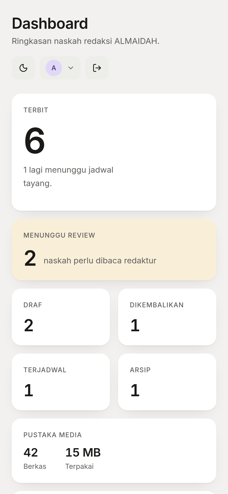
</p>

## Situs publik

Kerangka situs publik (Blade, bukan React) sudah berdiri dengan bahasa visualnya sendiri —
Cormorant Garamond + Inter. Navbar mengambil rubrik langsung dari basis data: menandai sebuah
rubrik "tampil di navbar" di panel langsung mengubah menu publik.

<p align="center">
  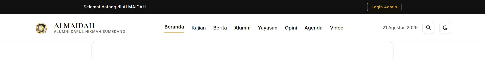
</p>

---

## Status pengerjaan

Yang sudah jalan:

- [x] Masuk dua tahap (email atau nomor HP), lupa sandi, undangan, wajib ganti sandi
- [x] Peran &amp; hak akses berbasis peran aktif (6 peran, 30 permission)
- [x] Menu panel dari basis data, per peran
- [x] Modul pengguna: daftar, saring, undang, kirim ulang, sunting, aktif/nonaktif
- [x] Profil alumni &amp; byline
- [x] Dashboard ringkasan redaksi (angka nyata dari basis data)
- [x] Impor massal alumni dari CSV
- [x] Kerangka situs publik + navbar rubrik dinamis

Yang sedang dibangun — model, migrasi, status, dan permission-nya sudah ada, layarnya belum
(di panel bertanda **SEGERA**):

- [ ] Modul Artikel: tulis, ajukan, sunting
- [ ] Antrean Review: terima atau kembalikan dengan catatan
- [ ] Rubrik &amp; Pustaka Media
- [ ] Layar Peran &amp; Hak Akses dan Menu Panel
- [ ] Halaman baca publik: beranda, rubrik, artikel, profil penulis

Alur naskah sendiri sudah berbentuk: enam status — **Draf → Menunggu Review → Terjadwal →
Terbit**, dengan **Dikembalikan** dan **Arsip** sebagai cabangnya. Artikel terjadwal otomatis
tampil di publik begitu waktunya lewat, tanpa perlu cron.

## Teknologi

| Lapis | Pilihan |
| --- | --- |
| Backend | Laravel 13, PHP 8.3+ |
| Panel admin | Inertia 3 + React 19 + TypeScript |
| Situs publik | Blade |
| Gaya | Tailwind 4, shadcn/ui (primitif Radix) |
| Hak akses | spatie/laravel-permission 8 |
| Basis data | PostgreSQL (SQLite untuk pengembangan &amp; tes) |
| Kunci utama | UUID, soft delete, kolom audit `created_by`/`updated_by`/`deleted_by` |

## Jalankan lokal

```bash
git clone <repo> almaidah && cd almaidah
composer setup            # install, .env, key, migrate, npm install, build
php artisan db:seed       # peran, permission, menu, rubrik, akun admin
composer dev              # server + vite + queue + log
```

Akun awal dari seeder:

```
admin@almaidah.id / password
```

Ganti sandi itu sebelum aplikasi menyentuh internet.

`composer setup` memakai SQLite bawaan `.env.example`. Untuk PostgreSQL, setel `DB_*` di `.env`
lalu jalankan `php artisan migrate --seed`.

## Tes

```bash
composer test     # 28 tes, 98 asersi
```

Cakupannya: alur masuk dua tahap, throttle, pemaksaan ganti sandi, akses menu per peran, dan
modul pengguna (undang, sunting, nonaktifkan, batas mengubah akses sendiri).

## Struktur

```
app/
  Console/Commands/ImportAlumni.php    impor CSV alumni
  Enums/ArticleStatus.php              enam status naskah
  Http/Controllers/Admin/              dashboard, pengguna, profil, peran aktif
  Http/Controllers/Auth/               masuk, lupa sandi, ganti sandi
  Http/Middleware/RequirePasswordChange.php
  Models/                              User, Article, Category, Media, MenuItem, Role
  Services/MenuService.php             menu per peran aktif, sebagai pohon
database/seeders/                      permission, peran, menu, rubrik, admin awal
resources/js/admin/                    panel Inertia + React
resources/views/                       situs publik (Blade)
design.md                              sistem desain panel — dibaca sebelum menulis UI baru
```

## Lisensi

MIT.
