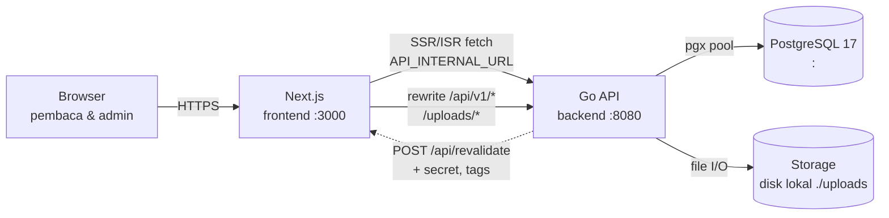
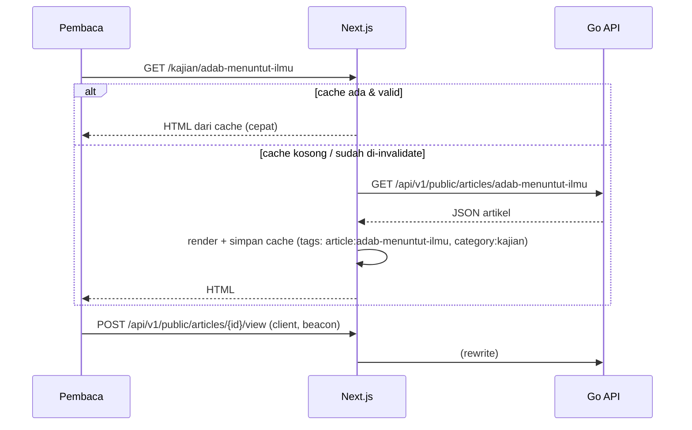
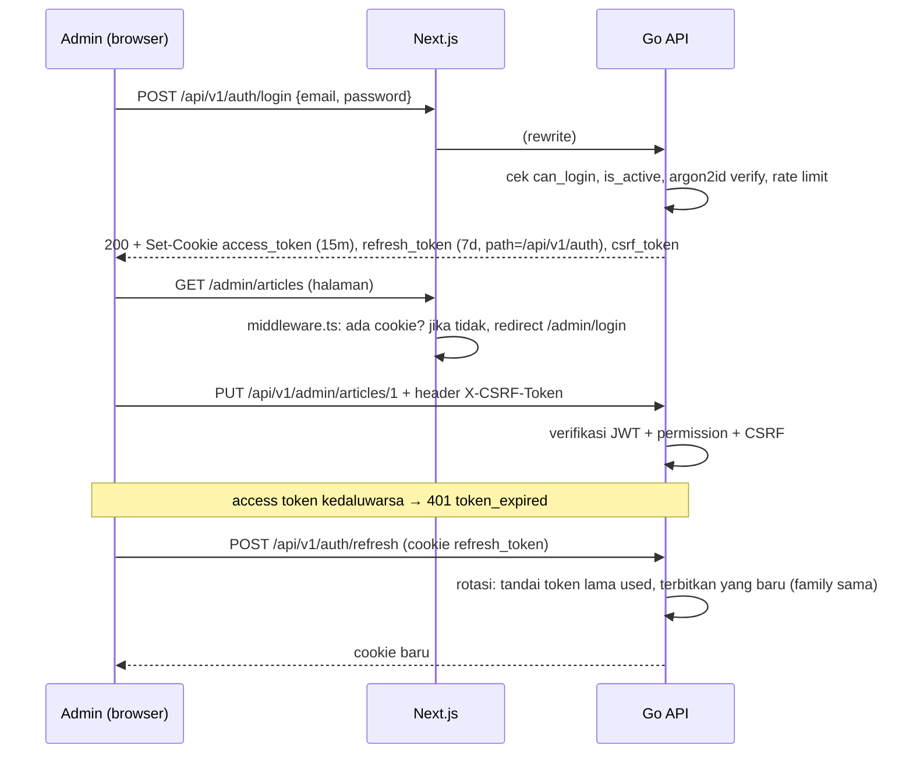

# 03 — Arsitektur Sistem

## 1. Gambaran umum



- **Browser hanya berbicara dengan Next.js (satu origin).** Request ke `/api/v1/*` dan
  `/uploads/*` di-*rewrite* oleh Next.js ke Go API. Akibatnya cookie auth bersifat
  *first-party*, tidak ada masalah CORS di produksi, dan tidak perlu `SameSite=None`.
- **Server Component Next.js** memanggil Go API langsung melalui `API_INTERNAL_URL`
  (misal `http://127.0.0.1:8080`) untuk render SSR/ISR.
- **Go API** adalah satu-satunya komponen yang mengakses database dan storage.
- **Revalidasi:** setiap mutasi konten di Go memicu webhook ke Next.js untuk menghapus
  cache halaman yang terdampak (berbasis *cache tag*).

## 2. Tech stack

### Backend (`backend/`)

| Kebutuhan | Library | Catatan |
|---|---|---|
| Bahasa | Go 1.27.1 (toolchain dari `go.mod`, `GOTOOLCHAIN=auto`) | Router pattern bawaan tidak dipakai, digantikan Chi |
| HTTP router | `github.com/go-chi/chi/v5` | + `chi/middleware` (RequestID, RealIP, Recoverer, Timeout) |
| CORS (dev) | `github.com/go-chi/cors` | Hanya aktif jika `CORS_ORIGINS` diisi |
| Driver DB | `github.com/jackc/pgx/v5` (`pgxpool`) | |
| Query | `sqlc` (CLI, `go install`) | Kode Go dihasilkan dari `db/queries/*.sql` |
| Migrasi | `github.com/pressly/goose/v3` | Migrasi SQL di `db/migrations`, di-embed ke binary |
| JWT | `github.com/golang-jwt/jwt/v5` | HS256 |
| Password | `golang.org/x/crypto/argon2` | argon2id |
| Validasi | `github.com/go-playground/validator/v10` | |
| Sanitasi HTML | `github.com/microcosm-cc/bluemonday` | v1.0.27, untuk konten rich text; bluemonday + douceur |
| Config | `github.com/caarlos0/env/v11` + `github.com/joho/godotenv` | Load `.env` |
| Logging | `log/slog` (stdlib) | JSON di produksi, text di dev |
| Rate limit | `golang.org/x/time/rate` / internal copy | Login (dari auth) & endpoint view (dari ratelimit) |
| Slug | internal `slugutil` | Transliterasi + apostrophe → kebab-case, max 160 chars; reserved list (agenda, tokoh, video, dst.) |
| Gambar | `image`, `golang.org/x/image/webp` v0.24.0 | Membaca dimensi JPEG/PNG/GIF/WebP; resize ditangani `next/image` |
| Concurrency | `golang.org/x/sync/errgroup` v0.11.0 | errgroup untuk task paralel (resolver homepage, fetch data) |
| Test | `testing` + `github.com/stretchr/testify` | Integration test memakai schema terpisah; `go test -p 1` |

### Frontend (`frontend/`)

| Kebutuhan | Library | Catatan |
|---|---|---|
| Framework | Next.js (versi stabil terbaru saat scaffold) App Router | TypeScript `strict` |
| Styling | Tailwind CSS (v4, konfigurasi CSS-first `@theme`) | Token di `app/globals.css` |
| Font | `next/font/google` | Cormorant Garamond + Inter |
| Gambar | `next/image` | `remotePatterns`/path `/uploads` |
| Editor rich text (admin) | Tiptap (`@tiptap/react`, starter-kit, image, link, youtube) | Disimpan sebagai JSON + HTML |
| Form & validasi (admin) | `react-hook-form` + `zod` | Skema zod dipakai bersama untuk tipe |
| Drag & drop (section builder, menu) | `@dnd-kit/core` + `@dnd-kit/sortable` | |
| Data fetching admin | `@tanstack/react-query` | Cache & invalidasi di sisi klien |
| Komponen admin | Tailwind + primitif headless (Radix UI) | **Usulan**; lihat pertanyaan terbuka di dok 09 |
| Ikon | `lucide-react` | Mirip ikon garis di desain |
| Tema gelap | Script kecil anti-flash + `class="dark"` | Tanpa dependency |
| Lint/format | ESLint (next config) + Prettier + `prettier-plugin-tailwindcss` | |

## 3. Struktur monorepo

```
/opt/portal-berita
├── README.md                    # cara menjalankan singkat
├── Makefile                     # perintah gabungan (dev, migrate, sqlc, lint, test)
├── .gitignore
├── docs/                        # dokumen ini
│
├── backend/
│   ├── go.mod                   # module: portal-berita/backend
│   ├── .env.example
│   ├── sqlc.yaml
│   ├── cmd/
│   │   ├── api/main.go          # HTTP server
│   │   └── tool/main.go         # CLI: migrate up/down/status, seed, create-superadmin
│   ├── db/
│   │   ├── migrations/          # 00001_init.sql, ... (goose, di-embed)
│   │   ├── queries/             # articles.sql, users.sql, ... (input sqlc)
│   │   └── seed/                # data seed (SQL / Go)
│   ├── internal/
│   │   ├── config/              # struct Config + load env
│   │   ├── database/            # pgxpool, transaksi helper
│   │   ├── dbgen/               # OUTPUT sqlc (jangan diedit manual)
│   │   ├── httpx/               # response JSON, error, paginasi, binder, validator
│   │   ├── apperr/              # sentinels error domain
│   │   ├── authctx/             # context helper untuk user principal
│   │   ├── middleware/          # Authenticate, CSRF, logging
│   │   ├── auth/                # login, refresh, logout, jwt, password, handler
│   │   ├── rbac/                # konstanta permission, checker, guard
│   │   ├── audit/               # audit logger, list handler
│   │   ├── user/                # CRUD users & authors, handler
│   │   ├── role/                # CRUD roles, handler
│   │   ├── testdb/              # test helpers (//go:build integration)
│   │   ├── category/
│   │   ├── tag/
│   │   ├── article/             # termasuk scheduler publikasi terjadwal
│   │   ├── analytics/           # view tracking, trending, populer
│   │   ├── search/
│   │   ├── event/
│   │   ├── alumni/
│   │   ├── video/
│   │   ├── page/                # halaman statis
│   │   ├── snippet/             # announcement, breaking, quote, faq
│   │   ├── homepage/            # section builder + agregasi data homepage
│   │   ├── menu/
│   │   ├── setting/
│   │   ├── media/               # upload + interface Storage
│   │   │   └── storage/         # local.go (sekarang), s3.go (nanti)
│   │   ├── revalidate/          # klien webhook ke Next.js (async, retry)
│   │   ├── richtext/            # sanitasi HTML, hitung waktu baca, ekstrak teks
│   │   └── server/              # router.go: merakit semua handler
│   └── uploads/                 # file media (di-.gitignore)
│
└── frontend/
    ├── package.json
    ├── .env.example
    ├── next.config.ts           # rewrites /api/v1 & /uploads → Go
    ├── middleware.ts            # proteksi /admin (cek cookie)
    ├── public/brand/logo.png
    └── src/
        ├── app/
        │   ├── (public)/        # layout publik: announcement, header, footer
        │   │   ├── page.tsx                 # homepage (section builder)
        │   │   ├── [category]/page.tsx      # listing kategori
        │   │   ├── [category]/[slug]/page.tsx  # detail artikel
        │   │   ├── tag/[slug]/page.tsx
        │   │   ├── penulis/[slug]/page.tsx
        │   │   ├── cari/page.tsx
        │   │   ├── agenda/ (page.tsx, [slug]/page.tsx)
        │   │   ├── tokoh/  (page.tsx, [slug]/page.tsx)
        │   │   ├── video/  (page.tsx, [slug]/page.tsx)
        │   │   └── halaman/[slug]/page.tsx  # halaman statis
        │   ├── admin/           # CMS (lihat dok 07)
        │   ├── api/revalidate/route.ts
        │   ├── sitemap.ts
        │   ├── robots.ts
        │   ├── not-found.tsx
        │   └── globals.css      # Tailwind + token
        ├── components/
        │   ├── layout/          # AnnouncementBar, SiteHeader, SiteFooter, Breadcrumb, Container
        │   ├── sections/        # satu komponen per tipe section homepage
        │   ├── article/         # ArticleCard (varian), ArticleMeta, ArticleBody, RelatedArticles
        │   ├── ui/              # Eyebrow, SectionHeading, ImageBox, Pagination, TagChip, ThemeToggle
        │   └── admin/           # komponen khusus CMS
        ├── lib/
        │   ├── api/             # klien fetch server & client, tipe respons
        │   ├── seo/             # builder metadata & JSON-LD
        │   ├── format.ts        # tanggal id-ID, "3.2rb", waktu baca
        │   └── sections/        # registry tipe section + skema zod config
        └── types/
```

## 4. Alur utama

### 4.1 Render halaman publik (SSR + ISR)



- Setiap `fetch` di server memakai `next: { tags: [...], revalidate: 3600 }`.
  Waktu revalidasi 1 jam hanya **jaring pengaman**, karena pembaruan utama datang dari webhook.
- Data yang cepat berubah dan tidak kritis untuk SEO (angka view, trending) memakai
  `revalidate` lebih pendek (300 detik) dengan tag `trending`.

### 4.2 Revalidasi on-demand (Worker: debounce 1s, max wait 5s, batch 100)

1. Admin menyimpan/publish artikel melalui `PUT /api/v1/admin/articles/{id}`.
2. Service Go menyelesaikan transaksi DB, lalu **setelah commit** mengantrekan event revalidasi via `revalidate.Client.Enqueue(tags...)`:
   `article:{slug}`, `article:{slug_lama}` (bila slug berubah), `category:{slug}` per kategori & parent, `tag:{slug}` per tag, `author:{slug}`, `homepage`, `search`, `sitemap`.
3. Worker `revalidate` mengumpulkan tag dengan debounce **1 detik** (events dalam 1s digabung) dan max wait **5 detik**, dedup & sort, lalu kirim
   `POST {NEXT_REVALIDATE_URL}` dengan header `X-Revalidate-Secret` dan body `{"tags": [...]}`.
   Batch max **100 tags**. Jika gagal, retry **3x** dengan backoff **500ms / 2s / 8s**, skip pada 4xx (kecuali 408/429). Kegagalan dicatat di log; cache tetap segar sampai TTL jaring pengaman (1 jam).
4. Shutdown graceful: worker flush queue dengan deadline **5 detik**.
5. Route handler Next.js memverifikasi secret, lalu memanggil `revalidateTag(tag)` untuk setiap tag.

| Mutasi | Tag yang di-invalidate |
|---|---|
| Artikel | `article:{slug}`, `category:*` terkait, `tag:*` terkait, `author:{slug}`, `homepage`, `sitemap` |
| Kategori | `category:{slug}`, `menus`, `homepage`, `sitemap` |
| Tag | `tag:{slug}`, `homepage` |
| Event | `event:{slug}`, `events`, `homepage`, `sitemap` |
| Tokoh alumni | `alumni:{slug}`, `alumni`, `homepage`, `sitemap` |
| Video | `video:{slug}`, `videos`, `homepage`, `sitemap` |
| Halaman statis | `page:{slug}`, `sitemap` |
| Snippet | `snippets` (dipakai layout & homepage) |
| Homepage section | `homepage` |
| Menu | `menus` |
| Pengaturan | `settings` (dipakai semua halaman) |
| User (profil penulis) | `author:{slug}`, `homepage` |

### 4.7 Scheduler / cleanup jobs

Goroutine dengan `time.Ticker` per job, berjalan paralel di background:

| Job | Frekuensi | RunAtStart | Fungsi |
|---|---|---|---|
| `article.publish_due` | 1 menit | ✗ | Query `PublishDueArticles` (status=scheduled, published_at <= now), ubah status ke published, enqueue revalidasi |
| `snippet.window_transitions` | 1 menit | ✗ | Deteksi snippet yang mulai/berakhir tayang (starts_at/ends_at <= now), enqueue `snippets` & `homepage` jika >0 terjadi |
| `analytics.cleanup_dedup` | 24 jam | ✓ | Hapus baris `article_view_dedup` yang lebih tua dari 2 hari (untuk mencegah hash collision tahunan) |

Lifecycle (`cmd/api/main.go`):
1. Start HTTP server, `revalidate.Worker.Run()`, dan `jobs.Runner.Run()` dalam satu `errgroup`.
2. SIGTERM → HTTP server drain (10s), runner tunggu in-flight jobs.
3. `revalidate.Worker` flush queue dengan deadline **5 detik** (tanpa cancel context).
4. `pool.Close()` dan `g.Wait()`.

### 4.3 Autentikasi



**Detail:**

| Aspek | Nilai |
|---|---|
| Access token | JWT HS256, TTL **15 menit**, claims: `sub` (user id), `sid` (session/family id), `pv` (perm_version), `iss`, `exp`, `iat`. Cookie Max-Age = sisa lifetime sesi (bukan JWT TTL) |
| Refresh token | String acak 32 byte (base64url). DB hanya menyimpan **hash SHA-256**. TTL **absolut** 7 hari (30 hari jika `remember=true`), tanpa sliding |
| Rotasi | Setiap `/auth/refresh` menghasilkan token baru dengan family_id & expires_at sama. Token lama ditandai `rotated_at` |
| Deteksi reuse | Jika token yang sudah dirotasi dipakai lagi, **seluruh family dicabut** + audit `refresh_reuse`. Refresh never returns `token_expired` |
| Cookie | `HttpOnly`, `Secure` sesuai env, `SameSite=Lax`. Access: `Path=/`, Refresh: `Path=/api/v1/auth`, CSRF: not HttpOnly, `Path=/` |
| CSRF | *Double-submit*: header `X-CSRF-Token` harus sama dengan cookie `csrf_token` untuk semua non-GET di `/api/v1/admin/*` plus `/auth/logout`, `/auth/me` (PUT), `/auth/me/password` (PUT), `/auth/sessions/{id}` (DELETE) |
| Permission | Dimuat dari DB saat request (di-cache in-memory 60 detik per user), invalidasi via `perm_version`. Mismatch → 401 `token_expired` (klien refresh) |
| Logout | Cabut family refresh token, hapus cookie. Limiter in-memory per proses |
| Brute force | Rate limit login: 5 percobaan/menit per IP+email → 429 + `Retry-After`; run dummy argon2 untuk semua gagal (timing attack mitigation) |
| Password | argon2id (m=64MB, t=3, p=2), minimal 10 karakter |
| Pembatasan login | `can_login = false` atau `is_active = false` → 401 `invalid_credentials` "Email atau kata sandi salah." |
| **Keterbatasan** | **Access token valid ≤15 menit setelah logout/revoke** (JWT tidak dapat di-invalidate secara real-time); RealIP percaya X-Forwarded-For (akan di-tinjau Fase 6) |

**Di sisi Next.js:**
- `middleware.ts` hanya memeriksa **keberadaan** cookie `access_token` atau `refresh_token` untuk route `/admin/*` (kecuali `/admin/login`). Validasi sebenarnya selalu dilakukan Go.
- Klien admin (`lib/api/client.ts`) menangani 401 `token_expired` dengan satu kali `POST /auth/refresh`, lalu mengulang request. Request paralel berbagi satu promise refresh.

### 4.4 Upload media

1. Admin mengunggah file melalui `POST /api/v1/admin/media` (multipart).
2. Go memvalidasi: ukuran ≤ **5 MB** (gambar), MIME dideteksi dari *magic bytes* (`http.DetectContentType`), dan hanya menerima `image/jpeg`, `image/png`, `image/webp`, `image/gif`, `image/svg+xml` (SVG disanitasi atau ditolak; **usulan: tolak SVG** di MVP).
3. Nama file baru: `uploads/{yyyy}/{mm}/{uuid}.{ext}`. Nama asli disimpan di DB.
4. Dimensi gambar dibaca dan disimpan (`width`, `height`) untuk `next/image` dan mencegah layout shift.
5. Go menyajikan `/uploads/*` dengan header cache panjang (`Cache-Control: public, max-age=31536000, immutable`), karena nama file unik.
6. Optimasi ukuran/format dilakukan oleh `next/image` (AVIF/WebP, responsive `srcset`).

```go
// internal/media/storage/storage.go
type Storage interface {
    Put(ctx context.Context, key string, r io.Reader, contentType string) error
    Delete(ctx context.Context, key string) error
    URL(key string) string // URL publik
}
```

### 4.5 View tracking, trending & populer

Karena halaman di-cache (ISR), view **tidak bisa** dihitung saat render server. Mekanismenya:

1. Komponen klien `<ViewTracker articleId>` di halaman detail mengirim `navigator.sendBeacon('/api/v1/public/articles/{id}/view')` setelah halaman terlihat ≥ 5 detik.
2. Go menghitung `visitor_hash = sha256(ip + user_agent + tanggal + salt_harian)`, lalu melakukan `INSERT ... ON CONFLICT DO NOTHING` ke `article_view_dedup` (unik per artikel + hash + tanggal). IP mentah tidak disimpan.
3. Jika insert berhasil (view unik), `article_views_daily (article_id, day)` di-*upsert* `views = views + 1`, dan `articles.view_count` bertambah.
4. Bot yang terdeteksi dari user-agent diabaikan. Endpoint dibatasi 60 request/menit per IP.
5. Job harian menghapus data `article_view_dedup` yang lebih lama dari 2 hari.

| Widget | Query |
|---|---|
| Trending Hari Ini | `SUM(views)` di `article_views_daily` untuk hari ini + kemarin (jendela ~24–48 jam), artikel published, limit 5. Jika kurang dari 5 item, dilengkapi artikel terbaru |
| Artikel Populer | `SUM(views)` 30 hari terakhir, limit sesuai konfigurasi |
| "3.2rb ditonton" (video) | Kolom `view_count` di `videos` (diisi manual; sinkronisasi YouTube API adalah fase lanjutan) |

### 4.6 Pencarian

- Kolom `articles.search_vector tsvector` bersifat **generated/di-update oleh trigger** dari judul (bobot A), excerpt (B), dan teks isi (C).
- PostgreSQL tidak punya stemmer Bahasa Indonesia, sehingga dipakai konfigurasi **`simple`** + `unaccent` agar pencarian tidak sensitif aksen.
- Query memakai `websearch_to_tsquery('simple', unaccent($q))` (mendukung "frasa", `-kata`, `OR`), diurutkan dengan `ts_rank_cd` lalu `published_at`.
- **Fallback typo:** jika hasil FTS 0, dipakai `pg_trgm` `similarity(title, $q) > 0.3`.
- Index: GIN pada `search_vector`, GIN `gin_trgm_ops` pada `title`.
- Halaman `/cari?q=` dirender **dinamis** (tanpa ISR) dan diberi `noindex`.
- ⚠️ **Risiko:** user `portal` mungkin tidak punya hak `CREATE EXTENSION` untuk `unaccent` / `pg_trgm`. Hal ini dicek di Fase 1. Jika tidak ada hak, minta DBA memasangnya, atau pakai fallback tanpa unaccent/trigram (lihat dok 09).

### 4.7 Publikasi terjadwal

- Status artikel: `draft`, `scheduled`, `published`, `archived`.
- `scheduled` + `published_at` di masa depan. Goroutine scheduler di Go berjalan **setiap 1 menit**: `UPDATE ... SET status='published' WHERE status='scheduled' AND published_at <= now() RETURNING slug`, lalu memicu revalidasi.
- Query publik selalu menambahkan `status='published' AND published_at <= now()` sebagai pengaman.
- Aturan yang sama berlaku untuk periode tayang snippet (`starts_at`/`ends_at`). Karena snippet dirender dengan ISR, scheduler juga memicu tag `snippets` ketika sebuah snippet mulai/berakhir tayang.

## 5. Keamanan

| Area | Kontrol |
|---|---|
| Transport | HTTPS di produksi (reverse proxy, lihat `docs/deploy.md`); cookie `Secure` wajib (`COOKIE_SECURE=true`, divalidasi saat start bila `APP_ENV=production`). HSTS `max-age=63072000; includeSubDomains` dikirim Next.js hanya bila `NEXT_PUBLIC_SITE_URL` berawalan `https://` (boleh juga di proxy) |
| Header (Go API) | `X-Content-Type-Options: nosniff`, `Referrer-Policy: strict-origin-when-cross-origin`, `X-Frame-Options: DENY` di semua respons API & `/uploads` |
| Header (Next.js) | Lewat `next.config.ts` `headers()` untuk semua route: CSP, `nosniff`, `Referrer-Policy: strict-origin-when-cross-origin`, `X-Frame-Options: DENY`, `Permissions-Policy: camera=(), microphone=(), geolocation=(), payment=()` (fullscreen/PiP tidak dibatasi demi embed YouTube), tanpa `X-Powered-By`. `/admin/**` juga `X-Robots-Tag: noindex, nofollow` (proxy) + `Disallow: /admin` di robots.txt |
| CSP | Tanpa nonce (nonce memaksa render dinamis, bertentangan dengan ISR): `default-src 'self'; script-src 'self' 'unsafe-inline'` (+`'unsafe-eval'` hanya dev); `style-src 'self' 'unsafe-inline'`; `img-src 'self' data: blob: https://i.ytimg.com`; `frame-src` youtube-nocookie/youtube; `object-src 'none'; base-uri 'self'; form-action 'self'; frame-ancestors 'none'`; `upgrade-insecure-requests` bila https. **Trade-off:** `'unsafe-inline'` berarti CSP tidak menahan XSS skrip; pertahanan XSS bertumpu pada sanitasi server + escaping React. CSP menutup clickjacking, `<base>`, `<object>`, form-action, dan sumber eksternal |
| XSS | HTML rich text **disanitasi di server** (bluemonday, whitelist tag editorial + iframe YouTube `youtube-nocookie.com` saja); React meng-escape sisanya |
| SQL injection | Semua query berparameter (sqlc, pgx protokol extended; tidak memakai `simple_protocol`) |
| Autentikasi | Password argon2id; access JWT 15 menit (cookie HttpOnly, SameSite=Lax, Path=/), refresh token rotasi + deteksi reuse (HttpOnly, Path=`/api/v1/auth`); rate limit login 5/menit per IP+email → 429 + `Retry-After`. Access token yang sudah terbit tetap berlaku ≤ 15 menit setelah logout/revoke (keterbatasan diterima, dok 09 §4) |
| CSRF | Double-submit: header `X-CSRF-Token` = cookie `csrf_token` (non-HttpOnly) untuk semua metode tidak aman di `/admin/**` dan `/auth/logout` → 403 `csrf_failed`; ditambah SameSite=Lax |
| Otorisasi | Middleware `RequirePermission("articles.publish")` per route; tes `TestAdminRoutesRequireAuth` memastikan semua route admin → 401 tanpa login; super admin tidak bisa menurunkan/menghapus dirinya sendiri; minimal 1 super admin aktif harus selalu ada |
| IP klien / proxy | `X-Forwarded-For`/`X-Real-IP` hanya dipercaya dari peer di `TRUSTED_PROXIES` (default loopback; `none` = abaikan); XFF dibaca dari kanan. Reverse proxy wajib menimpa XFF. Dipakai untuk rate limit login, view beacon (60/menit/IP) dan preview (60/menit/IP) |
| Preview draft | Token preview (JWT, TTL pendek, terikat artikel). Token tidak valid/kedaluwarsa/milik artikel lain → 404 `no-store`, tidak pernah jatuh ke konten publik; proxy Next.js menolak `?preview=` yang bukan bentuk JWT (≤ 2048 karakter) sehingga tidak mem-bypass cache ISR |
| Upload | Validasi magic bytes + decode header gambar (JPEG/PNG/GIF/WebP; SVG ditolak → 415), batas ukuran `UPLOAD_MAX_MB` → 413, nama file acak, tidak ada eksekusi, `/uploads` tanpa listing direktori |
| Respons error | JSON envelope, `Cache-Control: no-store`; path API tak dikenal → 404 JSON, metode salah → 405 JSON |
| Secret | `.env` di-`.gitignore`; `.env.example` tanpa nilai rahasia; `JWT_SECRET` ≥ 32 byte acak; scan riwayat git tiap rilis (Fase 6: bersih) |
| Dependensi | `make vuln` = `govulncheck ./...` + `bun audit --audit-level=moderate`. Temuan govulncheck saat ini hanya bisa ditutup dengan upgrade Go (lihat dok 09 §4) |
| Audit | Tabel `audit_logs` (siapa, aksi, entitas, waktu, diff ringkas) untuk semua mutasi admin |
| DB | Koneksi ke IP publik: `sslmode=require`, serta firewall membatasi IP sumber (lihat dok 09) |

## 6. Observabilitas

- Log terstruktur `slog` dengan `request_id`, method, path, status, latency, dan user_id.
- `GET /healthz` (liveness) dan `GET /readyz` (cek ping DB).
- Error 5xx mengembalikan pesan generik ke klien. Detail hanya ada di log.
