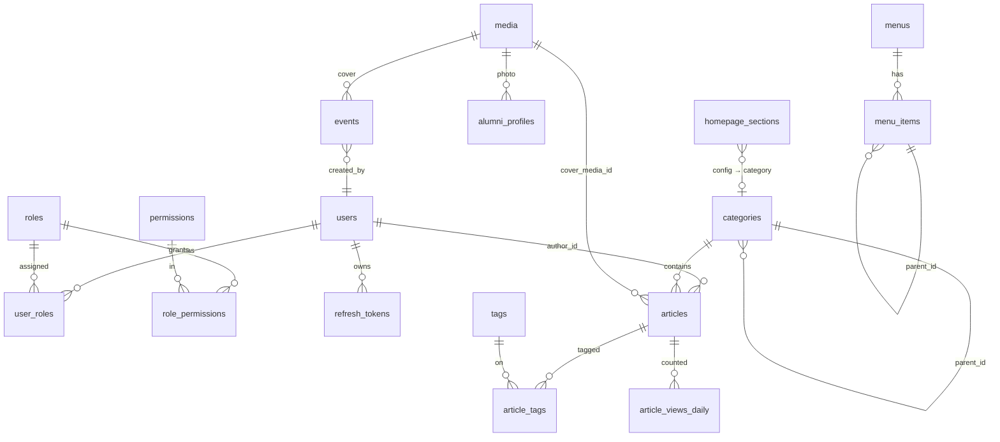

# 04 — Skema Database

**Target:** PostgreSQL 17.10 · database `portal_berita` · schema `public`
**Migrasi:** goose (`backend/db/migrations/NNNNN_nama.sql`), di-embed ke binary Go.

## 1. Konvensi

| Aturan | Keterangan |
|---|---|
| Primary key | `id BIGINT GENERATED ALWAYS AS IDENTITY`. URL publik memakai **slug**, bukan id |
| Waktu | `TIMESTAMPTZ`, disimpan UTC, ditampilkan `Asia/Jakarta` (WIB) |
| Audit kolom | `created_at`, `updated_at` (trigger `set_updated_at()`), `created_by`, `updated_by` (FK `users`) bila relevan |
| Soft delete | Hanya untuk `articles` (`deleted_at`). Entitas lain dihapus permanen, dengan audit log |
| Slug | `TEXT` unik, pola `^[a-z0-9]+(?:-[a-z0-9]+)*$` (CHECK constraint), maksimum 160 karakter |
| Enum | Memakai `TEXT` + `CHECK (... IN (...))`, lebih mudah diubah lewat migrasi dibanding `CREATE TYPE` |
| Nama | `snake_case`, tabel jamak |
| JSONB | Hanya untuk data yang memang berbentuk dokumen: konten Tiptap, config section, nilai setting |
| Rich text | Disimpan dua kolom: `*_json JSONB` (sumber editor) dan `*_html TEXT` (sudah disanitasi, untuk render) |

## 2. Extension

```sql
CREATE EXTENSION IF NOT EXISTS unaccent;   -- pencarian tidak sensitif aksen
CREATE EXTENSION IF NOT EXISTS pg_trgm;    -- fallback typo & ILIKE cepat
CREATE EXTENSION IF NOT EXISTS citext;     -- email case-insensitive
```
> Dicek di Fase 1. Jika user `portal` tidak berhak membuat extension, lihat opsi di dok 09.

## 3. Diagram relasi



## 4. Tabel

### 4.1 Identitas & akses

#### `users` — akun admin **dan** profil penulis
| Kolom | Tipe | Null | Default | Keterangan |
|---|---|---|---|---|
| id | BIGINT identity | ✗ | | PK |
| email | CITEXT | ✓ | | UNIQUE. Boleh NULL untuk penulis tanpa login |
| phone | TEXT | ✓ | | UNIQUE. Format: `^8[0-9]{8,11}$` (CHECK). Nomor HP login, disimpan ternormalisasi (periksa `phone.Normalize()`) |
| password_hash | TEXT | ✓ | | argon2id (format PHC). NULL jika `can_login=false` |
| display_name | TEXT | ✗ | | Nama tampil, misal "Ust. Ahmad Fauzi" |
| slug | TEXT | ✗ | | UNIQUE, dipakai di `/penulis/[slug]` |
| title | TEXT | ✓ | | Gelar/jabatan, misal "Pengurus Yayasan" |
| bio | TEXT | ✓ | | Bio singkat |
| avatar_media_id | BIGINT | ✓ | | FK `media(id)` ON DELETE SET NULL |
| can_login | BOOLEAN | ✗ | `false` | Jika `true`, (email OR phone) & password wajib (CHECK) |
| is_active | BOOLEAN | ✗ | `true` | Nonaktif = tidak bisa login dan tidak tampil di pilihan penulis |
| must_change_password | BOOLEAN | ✗ | `false` | Jika `true`, user harus ganti password sebelum akses dasbor. Diset ke `false` setelah ganti password pertama kali |
| last_login_at | TIMESTAMPTZ | ✓ | | |
| perm_version | INT | ✗ | `1` | Dinaikkan saat role berubah atau password wajib diganti (invalidasi cache permission) |
| created_at / updated_at | TIMESTAMPTZ | ✗ | `now()` | |

Constraint: `CHECK (NOT can_login OR (password_hash IS NOT NULL AND (email IS NOT NULL OR phone IS NOT NULL)))`.

#### `roles`
| Kolom | Tipe | Keterangan |
|---|---|---|
| id | BIGINT identity | PK |
| code | TEXT UNIQUE | `super_admin`, `admin` (nanti `editor`, `writer`, …) |
| name | TEXT | Label tampil |
| description | TEXT NULL | |
| is_system | BOOLEAN default false | Role sistem tidak bisa dihapus |

#### `permissions`
| Kolom | Tipe | Keterangan |
|---|---|---|
| id | BIGINT identity | PK |
| code | TEXT UNIQUE | Format `resource.action` |
| description | TEXT | |

#### `role_permissions` (`role_id`, `permission_id`) — PK gabungan, FK CASCADE
#### `user_roles` (`user_id`, `role_id`) — PK gabungan, FK CASCADE

#### Daftar permission awal

| Permission | super_admin | admin |
|---|:-:|:-:|
| `dashboard.view` | ✅ | ✅ |
| `articles.read` · `articles.create` · `articles.update` · `articles.delete` | ✅ | ✅ |
| `articles.publish` (publish/unpublish/jadwalkan) | ✅ | ✅ |
| `articles.update_any` (edit artikel milik penulis lain) | ✅ | ✅ |
| `categories.manage` · `tags.manage` | ✅ | ✅ |
| `media.manage` | ✅ | ✅ |
| `events.manage` · `alumni.manage` · `videos.manage` | ✅ | ✅ |
| `pages.manage` · `snippets.manage` | ✅ | ✅ |
| `homepage.manage` · `menus.manage` | ✅ | ✅ |
| `authors.manage` (kelola profil penulis `can_login=false`) | ✅ | ✅ |
| `settings.manage` (identitas situs, kontak, sosmed, SEO default) | ✅ | ❌ |
| `users.manage` (akun login, reset password, assign role) | ✅ | ❌ |
| `roles.manage` | ✅ | ❌ |
| `audit.view` | ✅ | ❌ |

> Pembagian `admin` di atas adalah **usulan default** dan bisa diubah dari data kapan saja.
> Untuk role `editor` di masa depan cukup INSERT role baru + permission-nya.

#### `refresh_tokens`
| Kolom | Tipe | Keterangan |
|---|---|---|
| id | BIGINT identity | PK |
| user_id | BIGINT | FK `users` CASCADE |
| family_id | UUID | Satu family = satu sesi login (dibuat dengan `gen_random_uuid()`) |
| token_hash | BYTEA UNIQUE | SHA-256 dari token |
| expires_at | TIMESTAMPTZ | |
| rotated_at | TIMESTAMPTZ NULL | Terisi saat sudah ditukar |
| revoked_at | TIMESTAMPTZ NULL | Terisi saat logout / reuse terdeteksi |
| user_agent | TEXT NULL | Untuk daftar "sesi aktif" |
| ip | INET NULL | |
| created_at | TIMESTAMPTZ | |

Index: `(user_id)`, `(family_id)`, `(expires_at)` untuk pembersihan.

#### `audit_logs`
| Kolom | Tipe | Keterangan |
|---|---|---|
| id | BIGINT identity | PK |
| user_id | BIGINT NULL | FK SET NULL |
| action | TEXT | `login`, `login_failed`, `logout`, `refresh_reuse`, `password_change`, `reset_password`, `session_revoke`, `create`, `update`, `delete`, `activate`, `deactivate` |
| entity_type | TEXT | `user` (untuk auth events), `article`, `category`, `tag`, `role`, dll. |
| entity_id | BIGINT NULL | |
| summary | TEXT | Deskripsi singkat, misal "Publish artikel 'Menjaga Keikhlasan…'" |
| changes | JSONB NULL | Diff field penting (tanpa isi panjang); nil → NULL |
| ip | INET NULL | |
| created_at | TIMESTAMPTZ | Index `(entity_type, entity_id)`, `(created_at DESC)` |

### 4.2 Media

#### `media`
| Kolom | Tipe | Keterangan |
|---|---|---|
| id | BIGINT identity | PK |
| storage_key | TEXT UNIQUE | `2026/09/2f1c….webp` |
| url | TEXT | URL publik (`/uploads/…`) |
| original_name | TEXT | |
| mime_type | TEXT | |
| size_bytes | BIGINT | |
| width / height | INT NULL | |
| alt_text | TEXT NULL | Teks alternatif default (SEO & aksesibilitas) |
| caption | TEXT NULL | Keterangan/kredit foto |
| uploaded_by | BIGINT NULL | FK users |
| created_at | TIMESTAMPTZ | |

Penghapusan media yang masih direferensikan ditolak (FK `RESTRICT` dari cover), kecuali referensinya opsional (`SET NULL`).

### 4.3 Konten editorial

#### `categories`
| Kolom | Tipe | Keterangan |
|---|---|---|
| id | BIGINT identity | PK |
| parent_id | BIGINT NULL | FK `categories` (maksimal **2 level**, divalidasi di service) |
| name | TEXT | "Kajian", "Fikih" |
| slug | TEXT UNIQUE | |
| description | TEXT NULL | Tampil di halaman listing |
| sort_order | INT default 0 | |
| is_active | BOOLEAN default true | |
| seo_title / seo_description | TEXT NULL | |
| created_at / updated_at | | |

Slug kategori **level 1** tidak boleh bentrok dengan route yang dicadangkan (lihat dok 06 §2):
`agenda, tokoh, video, tag, cari, penulis, halaman, admin, api, uploads, sitemap.xml, robots.txt, feed, _next`.

#### `tags`
| Kolom | Tipe | Keterangan |
|---|---|---|
| id | BIGINT identity | PK |
| name | TEXT UNIQUE | |
| slug | TEXT UNIQUE | |
| created_at | | |

#### `articles`
| Kolom | Tipe | Null | Keterangan |
|---|---|---|---|
| id | BIGINT identity | ✗ | PK |
| title | TEXT | ✗ | Maks 200 karakter |
| slug | TEXT | ✗ | UNIQUE (global, antar kategori) |
| excerpt | TEXT | ✓ | Ringkasan (maks 300). Jika kosong, di-generate dari isi |
| content_json | JSONB | ✗ | Dokumen Tiptap |
| content_html | TEXT | ✗ | HTML tersanitasi |
| content_text | TEXT | ✗ | Teks polos (untuk FTS & waktu baca) |
| cover_media_id | BIGINT | ✓ | FK `media` SET NULL |
| cover_caption | TEXT | ✓ | Menimpa caption media |
| category_id | BIGINT | ✗ | FK `categories` RESTRICT (boleh subkategori) |
| author_id | BIGINT | ✗ | FK `users` RESTRICT: **penulis tampil** |
| status | TEXT | ✗ | `draft` \| `scheduled` \| `published` \| `archived` |
| published_at | TIMESTAMPTZ | ✓ | Wajib jika `scheduled`/`published` (CHECK) |
| is_featured | BOOLEAN | ✗ | Kandidat hero homepage |
| is_breaking | BOOLEAN | ✗ | Ikut ditampilkan di breaking ticker |
| reading_minutes | SMALLINT | ✗ | `ceil(jumlah_kata / 200)`, minimal 1 |
| event_date | DATE | ✓ | Untuk kategori Yayasan (timeline) |
| event_location | TEXT | ✓ | |
| view_count | BIGINT | ✗ | default 0 (total sepanjang masa) |
| seo_title | TEXT | ✓ | Default = title |
| seo_description | TEXT | ✓ | Default = excerpt |
| og_media_id | BIGINT | ✓ | Default = cover |
| canonical_url | TEXT | ✓ | Untuk artikel yang juga terbit di tempat lain |
| search_vector | TSVECTOR | ✗ | Diisi trigger |
| created_by / updated_by | BIGINT | ✓ | FK users (yang menginput) |
| created_at / updated_at | TIMESTAMPTZ | ✗ | |
| deleted_at | TIMESTAMPTZ | ✓ | Soft delete |

**Index:**
- `(status, published_at DESC) WHERE deleted_at IS NULL` untuk listing terbaru
- `(category_id, status, published_at DESC)`
- `(author_id, published_at DESC)`
- `(is_featured, published_at DESC) WHERE status='published'`
- `(event_date DESC) WHERE event_date IS NOT NULL`
- `GIN (search_vector)`, `GIN (title gin_trgm_ops)`

**Trigger `articles_search_vector`:**
```sql
NEW.search_vector :=
    setweight(to_tsvector('simple', unaccent(coalesce(NEW.title,''))),   'A') ||
    setweight(to_tsvector('simple', unaccent(coalesce(NEW.excerpt,''))), 'B') ||
    setweight(to_tsvector('simple', unaccent(coalesce(NEW.content_text,''))), 'C');
```

#### `article_tags` (`article_id`, `tag_id`) — PK gabungan, CASCADE, index `(tag_id)`

#### `article_slug_redirects`
Mencatat slug lama agar URL lama tetap berfungsi (redirect 301) ketika slug atau kategori berubah.
| Kolom | Tipe |
|---|---|
| old_slug | TEXT PK |
| article_id | BIGINT FK CASCADE |
| created_at | TIMESTAMPTZ |

### 4.4 Analitik

#### `article_views_daily`
| Kolom | Tipe | Keterangan |
|---|---|---|
| article_id | BIGINT | FK CASCADE |
| day | DATE | Tanggal WIB |
| views | INT default 0 | |
| PK | (`article_id`, `day`) | Index tambahan `(day, views DESC)` |

#### `article_view_dedup`
| Kolom | Tipe | Keterangan |
|---|---|---|
| article_id | BIGINT | |
| visitor_hash | BYTEA | sha256(ip+ua+tanggal+salt) |
| day | DATE | |
| PK | (`article_id`, `visitor_hash`, `day`) | Dihapus setelah 2 hari oleh job harian |

### 4.5 Entitas non-artikel

#### `events` — Agenda
| Kolom | Tipe | Keterangan |
|---|---|---|
| id | BIGINT identity | PK |
| title | TEXT | "Reuni Akbar Alumni 2026" |
| slug | TEXT UNIQUE | |
| summary | TEXT NULL | |
| description_json / description_html | JSONB / TEXT NULL | Detail acara |
| starts_at | TIMESTAMPTZ | Tanggal + jam mulai |
| ends_at | TIMESTAMPTZ NULL | |
| is_all_day | BOOLEAN default false | Jika true, jam tidak ditampilkan |
| location_name | TEXT | "Kampus Pusat" |
| location_address | TEXT NULL | |
| maps_url | TEXT NULL | |
| cover_media_id | BIGINT NULL | |
| registration_url | TEXT NULL | Link pendaftaran (opsional) |
| status | TEXT | `draft` \| `published` \| `cancelled` |
| seo_title / seo_description | TEXT NULL | |
| created_by / updated_by, created_at / updated_at | | |

Index: `(status, starts_at)`.

#### `alumni_profiles` — Tokoh Alumni
| Kolom | Tipe | Keterangan |
|---|---|---|
| id | BIGINT identity | PK |
| name | TEXT | "Dr. H. Asep Suryana" |
| slug | TEXT UNIQUE | |
| role_title | TEXT | "Dosen & Peneliti" (label emas) |
| class_year | SMALLINT NULL | Angkatan, misal 1998 |
| short_bio | TEXT | Deskripsi singkat di kartu |
| story_json / story_html | JSONB / TEXT NULL | "Baca Kisah" (halaman detail) |
| photo_media_id | BIGINT NULL | Rasio 3:4 |
| is_featured | BOOLEAN default false | Tampil di homepage |
| sort_order | INT default 0 | |
| status | TEXT | `draft` \| `published` |
| seo_title / seo_description | TEXT NULL | |
| timestamps + created_by/updated_by | | |

#### `videos`
| Kolom | Tipe | Keterangan |
|---|---|---|
| id | BIGINT identity | PK |
| title | TEXT | |
| slug | TEXT UNIQUE | |
| youtube_id | TEXT | Diekstrak dari URL yang di-paste admin (validasi pola 11 karakter) |
| description | TEXT NULL | |
| duration_seconds | INT NULL | Ditampilkan "18:24" |
| view_count | BIGINT NULL | Diisi manual ("3.2rb ditonton") |
| thumbnail_media_id | BIGINT NULL | Jika NULL, dipakai `https://i.ytimg.com/vi/{id}/hqdefault.jpg` |
| published_at | TIMESTAMPTZ | |
| is_featured | BOOLEAN default false | Kandidat video besar |
| status | TEXT | `draft` \| `published` |
| timestamps | | |

#### `pages` — Halaman statis
| Kolom | Tipe | Keterangan |
|---|---|---|
| id | BIGINT identity | PK |
| title | TEXT | "Profil Yayasan" |
| slug | TEXT UNIQUE | `profil-yayasan` → `/halaman/profil-yayasan` |
| content_json / content_html | JSONB / TEXT | |
| status | TEXT | `draft` \| `published` |
| seo_title / seo_description / og_media_id | | |
| timestamps + created_by/updated_by | | |

#### `snippets` — Konten pendek
| Kolom | Tipe | Keterangan |
|---|---|---|
| id | BIGINT identity | PK |
| type | TEXT | `announcement` \| `breaking` \| `quote` \| `faq` |
| title | TEXT NULL | Pertanyaan (faq) |
| body | TEXT | Teks announcement/breaking/quote, jawaban FAQ (boleh HTML terbatas untuk faq) |
| source | TEXT NULL | Sumber quote, misal "QS. Al-Insyirah: 6" |
| link_url | TEXT NULL | Tautan untuk announcement/breaking |
| sort_order | INT default 0 | |
| is_active | BOOLEAN default true | |
| starts_at / ends_at | TIMESTAMPTZ NULL | Periode tayang (announcement/breaking) |
| timestamps | | |

Index: `(type, is_active, sort_order)`.

### 4.6 Homepage, menu, pengaturan

#### `homepage_sections`
| Kolom | Tipe | Keterangan |
|---|---|---|
| id | BIGINT identity | PK |
| type | TEXT | Salah satu tipe di registry (`hero_trending`, `article_grid`, …) (CHECK) |
| label | TEXT | Nama internal di admin, misal "Grid · Kajian" |
| position | INT | Urutan tampil (unik bersama `page_key`) |
| is_active | BOOLEAN default true | |
| config | JSONB | Konfigurasi sesuai skema tipe (divalidasi di backend **dan** frontend) |
| page_key | TEXT default `'home'` | Disiapkan agar kelak builder bisa dipakai untuk landing page lain |
| updated_by / timestamps | | |

Contoh `config`:
```json
{
  "eyebrow": "Kategori Utama",
  "title": "Kajian Terbaru",
  "category_slug": "kajian",
  "include_children": true,
  "limit": 3,
  "columns": 3,
  "show_excerpt": true,
  "more_link": { "label": "Lihat Semua Kajian →", "href": "/kajian" },
  "anchor_id": "kajian"
}
```
Skema per tipe dijelaskan di [06-frontend-publik.md](06-frontend-publik.md#section-types).

#### `menus`
| Kolom | Tipe | Keterangan |
|---|---|---|
| id | BIGINT identity | PK |
| code | TEXT UNIQUE | `header`, `footer_categories`, `footer_about`, `footer_legal` |
| name | TEXT | Label admin, misal "Footer · Kategori" |

#### `menu_items`
| Kolom | Tipe | Keterangan |
|---|---|---|
| id | BIGINT identity | PK |
| menu_id | BIGINT | FK CASCADE |
| parent_id | BIGINT NULL | Untuk dropdown (maksimal 2 level) |
| label | TEXT | |
| link_type | TEXT | `url` \| `category` \| `page` \| `route` (`/agenda`, `/video`, `/tokoh`, `/`) \| `anchor` |
| link_target | TEXT | URL, slug, atau route. Di-resolve menjadi href saat render |
| open_new_tab | BOOLEAN default false | |
| sort_order | INT | |
| is_active | BOOLEAN default true | |

Resolusi link dinamis (`category` → `/{slug}`) membuat perubahan slug otomatis mengikuti menu.

#### `site_settings` — key-value
| Kolom | Tipe | Keterangan |
|---|---|---|
| key | TEXT PK | |
| value | JSONB | |
| updated_by / updated_at | | |

Key yang digunakan:

| Key | Contoh nilai |
|---|---|
| `site.identity` | `{"name":"ALMAIDAH","tagline":"Alumni Darul Hikmah Sumedang","logo_media_id":1,"favicon_media_id":null}` |
| `site.footer` | `{"description":"Portal resmi alumni …","copyright":"© {year} ALMAIDAH — Alumni Darul Hikmah Sumedang. Seluruh hak cipta dilindungi."}` |
| `site.contact` | `{"address":"Jl. Darul Hikmah No. 1\nSumedang, Jawa Barat 45311","email":"redaksi@almaidah.id","phone":"(0261) 123-456"}` |
| `site.social` | `[{"platform":"instagram","url":"…"},{"platform":"youtube","url":"…"},{"platform":"whatsapp","url":"…"}]` |
| `seo.defaults` | `{"title_template":"%s — ALMAIDAH","default_description":"…","default_og_media_id":null,"google_site_verification":""}` |
| `header.options` | `{"show_date":true,"show_search":true,"show_theme_toggle":true,"show_login_button":true,"login_label":"Login Admin"}` |

Backend memvalidasi setiap key terhadap struct Go, sehingga key yang tidak dikenal ditolak.

## 5. Urutan file migrasi

| File | Isi |
|---|---|
| `00001_extensions.sql` | unaccent, pg_trgm, citext + fungsi `set_updated_at()` + fungsi `immutable_unaccent()` |
| `00002_auth_rbac.sql` | users, roles, permissions, role_permissions, user_roles, refresh_tokens, audit_logs |
| `00003_media.sql` | media (+ FK `users.avatar_media_id`) |
| `00004_taxonomy.sql` | categories, tags |
| `00005_articles.sql` | articles, article_tags, article_slug_redirects, trigger search_vector |
| `00006_analytics.sql` | article_views_daily, article_view_dedup |
| `00007_events_alumni_videos.sql` | events, alumni_profiles, videos |
| `00008_pages_snippets.sql` | pages, snippets |
| `00009_site.sql` | homepage_sections, menus, menu_items, site_settings |
| `00010_seed_rbac.sql` | Data role & permission (bagian dari skema, bukan data contoh) |
| `00011_users_must_change_password.sql` | Tambah kolom `must_change_password BOOLEAN NOT NULL DEFAULT false` ke `users` |
| `00012_users_phone.sql` | Tambah kolom `phone TEXT` ke `users` dengan UNIQUE constraint dan CHECK format, update constraint login |

Seed **konten contoh** tidak dimasukkan ke migrasi. Seed dijalankan lewat `go run ./cmd/tool seed`
(idempoten, bisa dijalankan ulang) agar database produksi tidak otomatis terisi data contoh.

## 6. Seed

| Seed | Isi | Kapan |
|---|---|---|
| RBAC | role `super_admin`, `admin` + seluruh permission | Migrasi `00010` (selalu) |
| Super admin | Dari env `SEED_SUPERADMIN_EMAIL` / `SEED_SUPERADMIN_PASSWORD`, perintah `tool create-superadmin` | Sekali, saat setup |
| Struktur dasar | Menu header/footer, `site_settings` default, `homepage_sections` sesuai urutan desain, halaman statis kosong | `tool seed --base` |
| Konten contoh | Semua konten dari desain (lihat dok 02 §5) | `tool seed --demo` (hanya dev/staging) |

Urutan `homepage_sections` default (sesuai desain):

| pos | type | label | aktif |
|---|---|---|---|
| 10 | `hero_trending` | Hero + Trending Hari Ini | ✅ |
| 20 | `breaking_ticker` | Breaking News | ✅ |
| 30 | `article_grid` | Kajian Terbaru (3 kolom) | ✅ |
| 40 | `article_grid` | Berita Alumni (4 kolom) | ✅ |
| 50 | `latest_with_sidebar` | Berita Terbaru + Sidebar | ✅ |
| 60 | `quote_rotator` | Kutipan | ✅ |
| 70 | `timeline` | Kegiatan Yayasan | ✅ |
| 80 | `feature_split` | Opini | ✅ |
| 90 | `people_grid` | Tokoh Alumni | ✅ |
| 100 | `agenda_calendar` | Agenda | ✅ |
| 110 | `video_gallery` | Video | ✅ |
| 120 | `faq` | Pertanyaan Umum | ✅ |
| 130 | `newsletter` | Newsletter | ❌ |

Posisi memakai kelipatan 10 agar penyisipan mudah. Saat drag & drop, backend menormalkan ulang posisinya.
