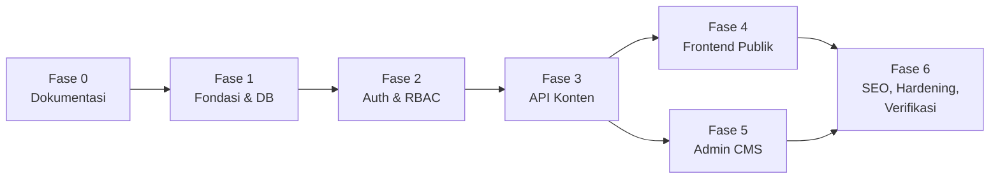

# 08 — Fase Kerja

Pekerjaan dibagi menjadi **7 fase** (Fase 0 sampai Fase 6). Setiap fase ditutup dengan
**laporan ke pemilik proyek** dan persetujuan sebelum lanjut ke fase berikutnya.

> Ringkasan awal di diskusi menyebut 5 tahap (Fondasi, Backend API, Frontend publik, Admin CMS,
> Verifikasi). Dokumen ini memecahnya lebih rinci: "Backend API" dibagi menjadi Fase 2 (auth &
> RBAC) dan Fase 3 (konten), serta ditambah Fase 0 (dokumentasi).

Fase 4 dan 5 **bisa berjalan paralel** setelah kontrak API (Fase 3) stabil. Urutan default-nya tetap 4 lalu 5,
karena tampilan publik adalah prioritas yang terlihat oleh komunitas.

Legenda: ☐ belum · ☑ selesai

---

## Fase 0 — Dokumentasi & Kesepakatan ☑

**Tujuan:** semua keputusan tertulis sebelum menulis kode.

- ☑ Diskusi 5 putaran (18 keputusan), lihat [01](01-diskusi-dan-keputusan.md)
- ☑ Analisis desain referensi, lihat [02](02-analisis-desain.md)
- ☑ Arsitektur, skema DB, API, frontend, admin (dok 03–07)
- ☑ Rencana fase (dokumen ini)
- ☑ Review dokumen oleh pemilik proyek

**Kriteria selesai:** pemilik proyek menyetujui dokumen, atau memberi koreksi yang kemudian diterapkan.

---

## Fase 1 — Fondasi Proyek & Database ☑

**Tujuan:** kerangka monorepo berjalan, skema database terpasang di server, dan data seed tersedia.

### 1.1 Repository
- ☑ `git init`, `.gitignore` (Go, Node, `.env`, `uploads/`, `.next/`, `node_modules/`)
- ☑ `README.md` root: prasyarat, cara setup, cara menjalankan
- ☑ `Makefile` dengan target: `dev-api`, `dev-web`, `migrate-up`, `migrate-down`, `migrate-status`, `sqlc`, `seed`, `lint`, `test`, `build`
- ☑ Commit pertama berisi `docs/` + kerangka

### 1.2 Verifikasi server database
- ☑ Cek hak user `portal`: `CREATE` di schema `public`, `CREATE EXTENSION` (unaccent, pg_trgm, citext)
- ☑ Cek dukungan TLS (`sslmode=require`)
- ☑ Cek zona waktu server dan `SHOW server_version`
- ☑ Jika extension tidak bisa dibuat: laporkan ke pemilik dan terapkan rencana cadangan (dok 09 §5)

### 1.3 Kerangka backend
- ☑ `go mod init portal-berita/backend`, struktur folder sesuai dok 03 §3
- ☑ `internal/config`: load `.env`, validasi variabel wajib, gagal cepat dengan pesan jelas
- ☑ `internal/database`: `pgxpool` (max conns 10, health check), helper transaksi `WithTx`
- ☑ `internal/httpx`: helper JSON response, error standar (dok 05 §1), decoder + validator, paginasi
- ☑ `internal/server`: router Chi + middleware dasar (RequestID, RealIP, logger slog, Recoverer, Timeout 30s, security headers)
- ☑ `GET /healthz`, `GET /readyz`
- ☑ Install tool: `sqlc`, `goose` (via `go install`, versi dikunci di `Makefile`/`tools.go`)
- ☑ `sqlc.yaml` (engine postgresql, pgx/v5, output `internal/dbgen`, emit JSON tags, override tipe `timestamptz` → `time.Time`)

### 1.4 Migrasi
- ☑ `00001` sampai `00010` sesuai dok 04 §5
- ☑ `cmd/tool migrate up|down|status|reset` (reset hanya jika `APP_ENV=development`)
- ☑ Uji `up` → `down` → `up` bersih tanpa error

### 1.5 Seed
- ☑ `cmd/tool create-superadmin --email --name` (password dari prompt/env, tidak dari argumen)
- ☑ `cmd/tool seed --base`: menu, settings, 13 homepage section default, halaman statis kosong
- ☑ `cmd/tool seed --demo`: seluruh konten contoh dari desain (dok 02 §5), dengan tanggal relatif
- ☑ Seed idempoten (upsert berdasarkan slug/key)
- ☑ Unduh logo dari proyek desain ke `frontend/public/brand/logo.png` + `backend/uploads/brand/logo.png`

### 1.6 Kerangka frontend
- ☑ `create-next-app` (TypeScript, App Router, Tailwind, ESLint, `src/`), Prettier + plugin Tailwind
- ☑ `next.config.ts`: rewrites `/api/v1/:path*` dan `/uploads/:path*` ke `API_INTERNAL_URL`
- ☑ `globals.css`: token warna/tipografi (dok 02 §2, dok 06 §7), font via `next/font`
- ☑ Halaman sementara `/` yang memanggil `/healthz` backend (membuktikan koneksi)

**Deliverable:** repo berjalan; `make migrate-up && make seed` membuat 20+ tabel berisi data contoh di server; `make dev-api` dan `make dev-web` jalan.

**Kriteria selesai:**
- `psql … -c '\dt'` menampilkan semua tabel
- `curl localhost:8080/readyz` → 200
- `localhost:3000` menampilkan status backend "OK"

---

### Catatan implementasi Fase 1 (26 September 2026)
- **Versi:** awalnya Go 1.22.5 (`GOTOOLCHAIN=local`); di Fase 6 di-upgrade ke go1.27.1 (`go.mod`, `GOTOOLCHAIN=auto`): chi v5.3.2, pgx v5.11.0, goose v3.28.0 (library), sqlc v1.31.1, staticcheck v0.8.1, govulncheck v1.8.0. Frontend: Next.js 16.3.6 (Turbopack, React 19), Tailwind 4.3.3, bun 1.3.14.
- **Database:** `sslmode=require`; sesi dipaksa `timezone=UTC` (default server Asia/Shanghai). Extension `unaccent`, `pg_trgm`, `citext` berhasil dibuat oleh user `portal`.
- **Seed `--base`** juga memuat kategori (13) dan media logo, karena menu & section homepage merujuk slug kategori. Kategori "Agenda" memakai slug `kabar-agenda` (`agenda` adalah rute cadangan).
- **homepage_sections:** unique `(page_key, position)` bersifat DEFERRABLE (untuk reorder), sehingga **tidak bisa** dipakai di `ON CONFLICT`. Seed memakai `WHERE NOT EXISTS`, dan Fase 3 harus memperhatikan hal ini.
- **Fallback typo:** gunakan `word_similarity(q, title)` (bukan `similarity`), misal "keiklasan" → 0.62 untuk artikel hero.
- **Tailwind v4:** token dipasang dengan `@theme inline` (bukan `@theme`) agar `.dark` dapat menukar nilai variabel.
- **Logo:** file asli dari proyek desain tidak bisa diunduh utuh (batas 256 KB, file 4034×4034). Sementara dipakai **placeholder** di `frontend/public/brand/logo.png` & `backend/uploads/brand/logo.png`; ganti dengan file asli (nama sama).
- **Next.js 16** menambahkan `frontend/AGENTS.md` (baca dokumentasi di `node_modules/next/dist/docs/` sebelum menulis kode Next) dan mengganti `middleware.ts` menjadi `proxy.ts` (relevan di Fase 5).
- **Hasil verifikasi:** migrasi up → down → reset → up bersih (25 tabel, 22 permission, 40 role_permission); seed dijalankan 2x dengan jumlah baris identik; `/healthz` & `/readyz` 200; rewrite `/api/v1/*` & `/uploads/*` via Next berfungsi; `make lint` & `make build` lulus.

---

## Fase 2 — Autentikasi & RBAC (Backend) ☑

**Tujuan:** admin bisa login/logout dengan aman, dan setiap endpoint admin dilindungi permission.

### 2.1 Auth
- ☑ `auth/password.go`: hash & verify argon2id (format PHC), plus test
- ☑ `auth/jwt.go`: terbit & verifikasi access token (HS256, `JWT_SECRET`), plus test kedaluwarsa & tanda tangan salah
- ☑ `auth/refresh.go`: buat token acak, simpan hash, rotasi, deteksi reuse → cabut family
- ☑ `auth/cookies.go`: set/clear cookie (`HttpOnly`, `Secure` sesuai env, `SameSite=Lax`, path)
- ☑ Endpoint: `POST /auth/login`, `/auth/refresh`, `/auth/logout`, `GET/PUT /auth/me`, `PUT /auth/me/password`, `GET/DELETE /auth/sessions`
- ☑ Rate limit login (5/menit per IP+email) + audit `login`, `login_failed`
- ☑ Tolak `can_login=false` / `is_active=false` dengan pesan generik

### 2.2 Middleware
- ☑ `Authenticate`: baca cookie → verifikasi JWT → isi `ctx` (user id, sid)
- ☑ `RequirePermission(perms ...string)`: muat permission (cache 60 detik, invalidasi via `perm_version`)
- ☑ `CSRF`: double-submit untuk non-GET di `/admin` & `/auth/logout`
- ☑ `Audit` helper: `audit.Log(ctx, action, entity, id, summary, changes)`

### 2.3 Manajemen user & role
- ☑ CRUD `/admin/users` (+ reset password, aktif/nonaktif), `/admin/authors` (dropdown)
- ☑ CRUD `/admin/roles`, `GET /admin/permissions`
- ☑ Aturan: super admin terakhir tidak bisa dinonaktifkan/diturunkan, user tidak bisa menonaktifkan diri sendiri
- ☑ `GET /admin/audit-logs`

### 2.4 Test
- ☑ Integration test (DB test schema terpisah): login sukses/gagal, refresh rotasi, reuse → semua sesi dicabut, logout, akses tanpa permission → 403, CSRF salah → 403

**Kriteria selesai:** seluruh skenario test hijau, dan alur login dapat dicoba via `curl` (dengan cookie jar) sesuai contoh di README.

---

### Catatan implementasi Fase 2 (26 September 2026)

- **Dependensi baru:** `github.com/golang-jwt/jwt/v5` v5.3.1 (satu-satunya tambahan di go.mod).
- **Paket baru:** `internal/{apperr, authctx, middleware, rbac, audit, user, role, testdb}`. Tidak ada migrasi database baru.
- **Error code 401 baru:** `invalid_credentials` ("Email atau kata sandi salah.") untuk login gagal.
- **Cookies:** access_token & refresh_token HttpOnly, SameSite=Lax, Secure sesuai env; CSRF token tidak HttpOnly. Max-Age = sisa umur sesi (7d, atau 30d dengan remember), sedangkan JWT internal valid 15 menit. Refresh expiry bersifat absolute (tidak sliding); rotasi mempertahankan family_id dan expires_at.
- **CSRF double-submit:** berlaku untuk semua non-GET `/api/v1/admin/*` dan mutasi auth (logout, PUT /me, PUT /me/password, DELETE /sessions).
- **Permission cache:** in-memory per proses, TTL 60 detik; mismatch perm_version → 401 token_expired → client refresh.
- **Login rate limit:** in-memory, 5/menit per IP+email → 429 + Retry-After.
- **Refresh reuse:** Jika token diputar kemudian dipakai kembali, seluruh family dicabut; tidak pernah return token_expired, hanya unauthenticated dengan pesan berbeda per kasus.
- **Test integration:** butuh `TEST_DATABASE_URL`, jalankan dengan `go test -p 1 -tags integration ./...` (schema terpisah, disposable).
- **Keterbatasan:** access token tetap valid ≤15 menit setelah logout/revoke; RealIP percaya X-Forwarded-For (akan di-tinjau ulang Fase 6).
- **Verifikasi live (API asli + DB remote):** login 200 dengan 3 cookie (path & HttpOnly sesuai), `/auth/me` 22 permission, CSRF tanpa header 403 / dengan header 200, endpoint admin 200, rotasi refresh + reuse → family dicabut (401/401), logout 204 → `/auth/me` 401, tanpa cookie 401, nonaktifkan diri sendiri 409, login salah ke-6 → 429. Seluruh suite integrasi (13 paket) lulus; tidak ada schema test tersisa.
- **Audit actions:** login, login_failed, logout, refresh_reuse, password_change, reset_password, session_revoke, create, update, delete, activate, deactivate; auth events gunakan entity_type "user".

---

## Fase 3 — API Konten (Backend) ☑

**Tujuan:** seluruh endpoint publik & admin di dok 05 tersedia, tervalidasi, dan memicu revalidasi.

### 3.1 Media
- ☑ Interface `Storage` + `LocalStorage` (folder `UPLOAD_DIR`, path `yyyy/mm/uuid.ext`)
- ☑ `POST /admin/media`: batas 5 MB, cek magic bytes, whitelist MIME (JPEG/PNG/GIF/WebP), baca dimensi
- ☑ List/update/delete (409 jika dipakai), serve `/uploads/*` dengan cache header

### 3.2 Taksonomi
- ☑ Kategori: CRUD, pohon 2 level, reorder (two-pass), validasi slug cadangan, `article_count`
- ☑ Tag: CRUD, merge, tag populer

### 3.3 Artikel
- ☑ `richtext`: sanitasi HTML (bluemonday policy: tag editorial, img dari `/uploads`, iframe `youtube-nocookie.com`), ekstrak teks, hitung waktu baca, excerpt otomatis
- ☑ CRUD admin + publish/unpublish/jadwalkan, soft delete & restore, slug-check, redirect slug lama (200 with redirect data)
- ☑ Scheduler 1 menit: publish artikel terjadwal + snippet mulai/berakhir tayang
- ☑ Preview token (HS256 JWT, issuer `almaidah-preview`, 30 menit, subject `article_id`)
- ☑ Endpoint publik: list (filter kategori+turunan/tag/penulis/featured), detail + related, `url` kanonik, view_count
- ☑ Penulis publik `/public/authors/{slug}`

### 3.4 Analitik & pencarian
- ☑ `POST /public/articles/{id}/view`: dedup hash harian (IP+UA+day+salt), filter bot, rate limit 60/min per IP (204 selalu)
- ☑ Trending (jendela hari/minggu) & populer (N hari), dengan fallback ke artikel terbaru
- ☑ Job harian pembersihan `article_view_dedup` (> 2 hari)
- ☑ `GET /public/search`: FTS (websearch_to_tsquery + ts_headline), fallback trigram (word_similarity > 0.3), X-Search-Fallback header

### 3.5 Entitas lain
- ☑ Events (upcoming/past, filter bulan Jakarta), Alumni (featured, reorder), Videos (parse URL YouTube), Pages (published), Snippets (reorder, window transitions)

### 3.6 Homepage, menu, settings
- ☑ Registry tipe section (13 tipe, dok 06 §3) dengan struct config + default + validasi + JSON Schema
- ☑ Resolver data per tipe, dijalankan paralel (`errgroup`), dengan deduplikasi artikel (dedupe flag, exclude_hero)
- ☑ `GET /public/homepage` (invalid config → skip section), CRUD + reorder (two-pass) `/admin/homepage/sections`, `GET /admin/homepage/section-types`
- ☑ Menu: resolusi link dinamis, `PUT /menus/{code}/items` (transaksi, max depth 2, whitelist route, slugs validated)
- ☑ Settings: validasi per key (6 key), media ID checked, `GET /public/site` (agregasi + resolved menus)
- ☑ `GET /public/sitemap` (kategori/artikel/tag/author/event/alumni/video/page)

### 3.7 Revalidasi
- ☑ `internal/revalidate`: antrean + debounce 1s + max wait 5s + batch 100 + retry 3x (backoff 500ms/2s/8s), dipanggil **setelah commit**
- ☑ Pemetaan mutasi → tag (dok 03 §4.2), diuji dengan Recorder

### 3.8 Dashboard
- ☑ `GET /admin/dashboard` (artikel status counts, views 7d, top_week, upcoming_events, recent_drafts)

### 3.9 Test
- ☑ Unit test: sanitasi HTML (payload XSS umum ditolak), slug, waktu baca, parser URL YouTube, validasi config section
- ☑ Integration test: CRUD artikel end-to-end, publikasi terjadwal, FTS, trending, homepage resolver dengan data seed
- ☑ E2E test: public seeded checks, admin login/CSRF, upload/create/publish/revalidate, view dedup, preview, homepage reorder, menus, settings, media delete, slug redirect, dashboard

**Kriteria selesai:** semua endpoint di dok 05 merespons sesuai kontrak, test hijau, dan koleksi request contoh (`docs/http/*.http` untuk REST Client/curl) tersedia.

---

### Catatan implementasi Fase 3 (27 September 2026)

- **Dependensi:** `github.com/microcosm-cc/bluemonday` v1.0.27, `golang.org/x/image` v0.24.0, `golang.org/x/sync` v0.11.0. `x/image/webp` untuk DecodeConfig WebP; versi 0.25+ memerlukan Go 1.23 (forbidden).
- **Tidak ada migrasi Fase 3:** schema v10 mencukupi; homepage reorder menggunakan DEFERRABLE unique + two-pass renumber.
- **Konten:**  `internal/content` berisi shared DTOs (ArticleCard, EventCard, AlumniCard, VideoCard), Hydrator (batch lookup), CategoryRef, AuthorRef, URL funcs. Setiap artikel list query mengembalikan `dbgen.Article` utuh; hydration di Go (3 batched queries).
- **Unpublish semantics:** status → draft, `published_at` tetap.
- **View dedup formula:** `visitor_hash = sha256(ip + "|" + user_agent + "|" + day_wib + "|" + HASH_SALT)`.
- **Search fallback:** threshold similarity 0.3 (word_similarity untuk artikel hero "keiklasan" → 0.62).
- **Test:** integration tests dengan `go test -p 1 -tags integration ./...` (schema isolated per package). E2E single test, `testdb.SeedBase + SeedDemo`, fake revalidate listener di :3999.
- **Live DB:** remote <DB_HOST>:<DB_PORT>, timezone forced UTC (display WIB), sslmode=require. Migrations append-only (00001–00010); Fase 3 tidak menambah. Seed base (menu, settings, 13 section default, kategori, logo) + demo (artikel, tokoh, event, video, snippet, section config) idempoten.
- **Hasil verifikasi:** /public/* cache-control 60s, redirect 200 JSON, preview no-store, trending excludes hero, search FTS+fallback, homepage 12 sections, menus resolved, settings keyed, sitemap structured, dashboard counts, media 413/415, article 422 validation, category reorder two-pass, admin E2E CSRF/auth/multipart/revalidate webhook captured.
- **Verifikasi live (API asli + DB remote, 27 Sep 2026):** `/public/site`, `/public/homepage` (12 section), artikel (21), detail + related 4, trending, pencarian `keikhlasan` (FTS) & `keiklasan` (fallback, header `X-Search-Fallback`), kategori/tag/agenda/tokoh/video/halaman/FAQ/sitemap 200; admin: dashboard, 13 tipe section, upload PNG 201 (dimensi terbaca) & exe-sebagai-jpg 415, artikel baru (script tersanitasi) 404 → publish → 200, view beacon 3x + bot = 1 view, webhook revalidasi diterima listener lokal dengan secret + tag benar. Data uji dihapus kembali (artikel 21, media 1).
- **Revalidasi profil penulis** ditambahkan pada `user.Service` (Create/Update/SetActive) dan `auth.Service.UpdateMe` → `author:{slug}`, `homepage`, `sitemap`.
- **Catatan flaky:** satu kali run penuh `go test -p 1 -tags integration ./...` paket `auth` gagal (detail terpotong), lalu lulus 3x berturut-turut. Diduga reset koneksi DB remote / test sensitif waktu; pantau & perbaiki di Fase 6 (simpan log penuh bila terulang).

---

## Fase 4 — Frontend Publik ☑

**Tujuan:** situs publik tampil sesuai desain, responsif, memakai data dinamis dari API.

### 4.1 Fondasi UI
- ☑ Klien API server (`apiGet` + tags + `React.cache`), tipe respons (`lib/api/types.ts`)
- ☑ Util format: tanggal `id-ID` WIB, tanggal ringkas ("25 Jul"), angka ringkas ("3.2rb"), durasi ("18:24")
- ☑ Komponen dasar: `Container`, `Eyebrow`, `SectionHeading`, `WidgetHeading`, `ImageBox`, `TagChip`, `Pagination`, `Breadcrumb`

### 4.2 Layout global
- ☑ `AnnouncementBar`, `SiteHeader` (sticky, nav aktif, tanggal, cari, tema, login), `SiteFooter`
- ☑ Menu mobile (drawer) + overlay pencarian
- ☑ Dark mode: variabel CSS, script anti-flash, `ThemeToggle`
- ☑ `api/revalidate/route.ts` (verifikasi secret, `revalidateTag`)

### 4.3 Homepage
- ☑ Registry komponen section + `SectionRenderer` (tipe tak dikenal → dilewati + warning di log)
- ☑ 13 komponen section (dok 06 §3), masing-masing dicek piksel demi piksel terhadap desain di lebar 1440px
- ☑ Komponen klien: `Marquee`, `QuoteRotator`, `FaqAccordion`; komponen server: `MonthCalendar`

### 4.4 Halaman dalam
- ☑ Detail artikel (+ `ViewTracker`, share, kotak penulis, terkait, redirect kanonik/slug lama, mode preview)
- ☑ Listing kategori (+ pill subkategori), tag, penulis, dengan paginasi
- ☑ Pencarian `/cari` (dinamis, highlight, keadaan kosong)
- ☑ Agenda (index + kalender navigasi bulan + detail), Tokoh (index + detail), Video (index + detail + lite embed)
- ☑ Halaman statis, `not-found`, `error`

### 4.5 Responsif & aksesibilitas
- ☑ Uji di 375px, 768px, 1024px, 1440px
- ☑ Keyboard navigation, fokus terlihat, `aria-*`, `prefers-reduced-motion`
- ☑ Review kontras teks emas (keputusan varian `gold-strong`, dok 06 §8)

**Kriteria selesai:**
- Homepage di 1440px secara visual setara desain (dibandingkan screenshot berdampingan)
- Semua route di dok 06 §2 bisa diakses dengan data seed
- Mengubah data di DB lalu memanggil webhook revalidate langsung mengubah halaman

---

### Catatan implementasi Fase 4 (27 September 2026)

- **Caching:** fetch Data Cache + ISR (bukan `cacheComponents`). Homepage & detail pages ISR (generated on first visit); listing & search pages dynamic (read `searchParams`). Revalidasi via webhook: `revalidateTag(tag, {expire: 0})` → stale-while-revalidate (first post-webhook request served stale, next fresh).
- **Revalidate route:** `src/app/api/revalidate/route.ts` returns 500 (no secret), 401 (bad secret), 400 (bad body), 200 `{revalidated: n}`. `REVALIDATE_SECRET` must match in `backend/.env` and `frontend/.env.local`.
- **Proxy & preview:** `src/proxy.ts` rewrites `/:category/:slug?preview=…` to `/halaman/pratinjau/[slug]` (no-store, noindex). Invalid preview token on published article bypasses ISR cache (Fase 6 hardening item).
- **Images:** `/uploads` and `i.ytimg.com` via `next/image`; no `dangerouslyAllowLocalIP` needed. Hero image has `preload` + `fetchPriority="high"`.
- **Tokens:** type-scale classes `text-display`, `text-h2`, `text-h3`, `text-quote`, `text-brand`, `text-lead`, `text-copy` (body), `text-caption` (meta); color classes `text-body` / `text-meta` for text colors only (avoid collision). Ink surface tokens `bg-ink-surface`, `text-on-ink`, `text-on-ink-muted`; mark `bg-mark`.
- **Header:** nav shown from `xl` (≥1280px); hamburger below. Header date shown only at `2xl` (≥1536px) due to data-driven menu labels. Login Admin moves into mobile menu below `sm`.
- **Homepage:** calendar shows current month (seed config `calendar_month: "current"`); admin can set `next_event` to highlight event days. 12 sections built, preview route shows ● (ISR on first visit).
- **Search highlight:** backend returns HTML-escaped text with `<mark>` tags only; rendered with `dangerouslySetInnerHTML`. Card shows title as heading, highlight as sub-line.
- **QA & visual verification:** Playwright headless tests at 1440/1024/768/375 + dark mode; 9 pixel-level findings fixed (section spacing, arrows, today label, hero eyebrow, calendar, mobile header, sidebar numerals, ink borders, nowrap).
- **`bun run build`:** requires Go API running (homepage/sitemap prerender). `bun test` runs `format.ts` tests (18 pass). `NEXT_PRIVATE_DEBUG_CACHE=1` for cache verification in production mode.

---

## Fase 5 — Admin CMS ☑

**Tujuan:** admin dapat mengelola seluruh konten tanpa menyentuh kode atau database.

### 5.1 Shell & auth ☑
- ☑ `proxy.ts` proteksi `/admin`, halaman login, klien API admin (CSRF, auto-refresh), React Query provider
- ☑ Layout admin (sidebar sesuai permission, topbar, breadcrumb), halaman profil & sesi

### 5.2 Komponen admin ☑
- ☑ `DataTable`, `Field` set, `MediaPicker` (modal), `CategoryCombobox`/`CategorySelect`, `TagInput`, `ConfirmDialog`, `Toaster`, `SortableList` (dnd-kit), `DateTimePicker` (WIB)
- ☑ `RichTextEditor` (Tiptap: toolbar, gambar dari MediaPicker, YouTube, paste cleanup)

### 5.3 Halaman ☑
- ☑ Dashboard
- ☑ Artikel: list + editor lengkap (panel samping, autosave lokal, pratinjau, SEO snippet preview)
- ☑ Kategori (pohon drag & drop), Tag (merge), Media (upload multi, detail)
- ☑ Agenda, Tokoh, Video, Halaman
- ☑ Snippet (4 tab, sortable)
- ☑ **Section builder** (sortable, toggle, galeri tipe, form dinamis dari JSON Schema, peringatan section kosong)
- ☑ Menu (pohon sortable, pemilih tipe tautan)
- ☑ Pengaturan (6 tab), Pengguna & Penulis, Role (matriks permission), Log aktivitas

**Kriteria selesai:** skenario uji penerimaan (§ Uji Penerimaan di bawah) dapat dijalankan penuh melalui UI.

---

### Catatan implementasi Fase 5 (27 September 2026)

- **shadcn/ui radix-vega:** 43 komponen di `src/components/ui/shadcn/` (button, input, textarea, select, checkbox, switch, label, field, dialog, sheet, popover, tabs, table, badge, calendar, pagination, breadcrumb, accordion, dan lainnya), dipasang via `bunx shadcn add -y`. CLI mencoba menambah next-themes dan pin recharts — hasilnya dikembalikan ke package.json asli (no next-themes, @tanstack/react-query tetap ^5). components.json adalah radix-vega dengan ui alias ke @/components/ui/shadcn.
- **Theme mapping ke token:** --radius 0px (square). Danger (#b42318 / dark #e5484d) dan Success (#1f7a3a / dark #4cc07a) adalah variabel baru. Semua shadcn vars di globals.css dipetakan ke token kami (--paper, --ink, --gold, --line, --c-meta, dst.) sehingga .dark memutar nilai otomatis tanpa redefine.
- **cn dikonfigurasi di src/lib/cn.ts:** `createCn` (paket `cn/config`) yang mengenali token ukuran teks kustom (text-copy*/text-caption*, dll.) dan tidak membuang `leading-*` saat ada ukuran font. Semua komponen (termasuk shadcn) mengimpor `cn` dari `@/lib/cn`; tidak ada src/lib/utils.ts.
- **Tidak ada komponen form:** radix-vega form kosong; gunakan `field` (FieldLabel, FieldError, FieldDescription) + Controller dari react-hook-form.
- **Pickers WIB:** DatePicker, TimePicker, DateTimePicker, DateRangePicker di src/components/ui/pickers/, terima RFC3339 dan emitkan 'YYYY-MM-DD' / 'HH:mm' / RFC3339 dengan offset +07:00.
- **Admin API client (src/lib/api/client.ts):** request<T>(path, {method, body?, query?, signal?}) → {data, meta?, status, headers}. CSRF token dibaca dari document.cookie. Pada 401 token_expired: refresh single-flight di level modul (POST /auth/refresh), baca ulang csrf cookie yang dirotasi, retry sekali. Query client staleTime 30s, refetchOnWindowFocus false.
- **proxy.ts (bukan middleware.ts):** matcher /admin dan /admin/:path*. Semua /admin/* tanpa access_token cookie → 307 redirect /admin/login?next=…. X-Robots-Tag: noindex, nofollow di setiap response /admin.
- **Editor Tiptap:** RichTextEditor output shape adalah getJSON() (object dengan type, content, marks) dan getHTML() (string). Figure.image dan figure.youtube tanpa div wrapper. Sanitizer Go mengescape ' dan " sebagai &#39; dan &#34; — perbandingan "unsaved changes" harus JSON-to-JSON, bukan HTML string.
- **Section builder:** SectionConfigForm render schema.properties dalam urutan; field order ditentukan admin atau dari default_config key order (schema properties tiba alfabetis dari backend). Mapping: x-ui category_slug → CategoryCombobox; tag_slug → TagCombobox; article_id → ArticleSearchCombobox; widgets → SortableCheckList; richtext → RichTextEditor; textarea → Textarea; boolean → Switch; enum → Select atau ToggleGroup; integer+min/max → Input number.
- **Media endpoints baru:** GET /admin/media/{id} dan GET /admin/media?ids=1,2,3 (max 100, preserves order, 400 invalid).
- **Migrasi publik ke shadcn:** pixel-diff ~0% vs baseline (Q4 screenshots). Dialog pencarian, Sheet menu mobile, Accordion FAQ, Button/Input/Badge/Pagination/Breadcrumb semua shadcn. base rule border aktif masih commented (akan W1-G enable setelah border audit).
- **Theme script via next/script beforeInteractive:** set .dark class sesuai localStorage + system preference (no flash).
- **List markers prose:** marker bullet/numbered diperbaiki (sebelumnya inherit dari public).
- **Keterbatasan/deferred:** media "dipakai oleh" list tidak ditampilkan. Preview live section builder tidak ada (admin lihat peringatan section kosong). Agenda admin tanpa filter backend `when` (tidak relevant untuk CRUD). Server layout tidak bisa refresh karena path cookie refresh terbatas /api/v1/auth — client melakukan refresh.
- **Uji penerimaan e2e (Playwright, build produksi :3000, 27 Sep 2026):** skenario 1 (penulis tanpa login), 2 (artikel + tag + cover → homepage/kategori/tag/pencarian ≤10 dtk), 3 (jadwal → terbit setelah tick scheduler), 4 (ganti slug → 308), 5–6 (urutan/visibilitas section + section baru), 7 (kontak & sosmed → footer), 8 (menu "Beasiswa" di header desktop & sheet mobile), 12 (role terbatas: menu Pengaturan tersembunyi, panel 403, API 403), 14 (upload exe → 415, >5 MB → 413), serta guard /admin, X-Robots-Tag, logout — **semua lulus**. Catatan: halaman ISR menampilkan versi lama pada request pertama setelah perubahan (stale-while-revalidate), versi baru pada request berikutnya. Semua data uji dihapus; DB kembali ke jumlah seed.
- **Batasan menu header:** di 1440px muat ±9 item (label seperti "Tokoh Alumni" memakan ruang); lebih dari itu akan menabrak tombol kanan — pertimbangkan dropdown "Lainnya" di Fase 6 bila menu bertambah.

---

## Fase 6 — SEO, Hardening & Verifikasi ☑

**Tujuan:** siap dipakai komunitas: SEO lengkap, aman, dan terverifikasi end-to-end.

### 6.1 SEO ☑
- ☑ `generateMetadata` semua route, JSON-LD (Organization, WebSite+SearchAction, NewsArticle, BreadcrumbList, Event, Person, VideoObject)
- ☑ `sitemap.ts`, `robots.ts`, canonical absolut, `noindex` untuk cari/preview/admin
- ☑ RSS `/feed.xml`, OG default, Google verification, JSON-LD enrichment

### 6.2 Performa ☑
- ☑ Lighthouse mobile: Performance ≥ 90, SEO 100, Accessibility ≥ 95, Best Practices ≥ 95
- ☑ Cek ukuran bundle JS halaman publik, `sizes` pada `next/image`, dan hero `priority`
- ☑ `EXPLAIN ANALYZE` query utama (homepage, listing, search, trending) dengan data ±1.000 artikel sintetis

### 6.3 Keamanan ☑
- ☑ Review: sanitasi, CSRF, cookie flags, rate limit, upload, header keamanan, permission tiap route (test otomatis yang men-enumerasi route admin tanpa auth → semua 401)
- ☑ `govulncheck` & `bun audit`
- ☑ Pastikan tidak ada secret di repo (`git grep` password/secret)

### 6.4 Build & jalankan mode produksi (tanpa Docker) ☑
- ☑ `go build -o bin/api ./cmd/api` dan `next build && next start`
- ☑ Contoh unit **systemd** untuk API & web + contoh konfigurasi reverse proxy (Nginx/Caddy) di `docs/deploy.md` (hanya dokumentasi, belum dieksekusi)
- ☑ Skrip backup DB (`pg_dump`) + folder `uploads/`

### 6.5 Uji penerimaan end-to-end ☑
Dijalankan manual bersama pemilik proyek (dan sebagian diotomasi dengan Playwright, **selesai**):

| # | Skenario | Hasil yang diharapkan |
|---|---|---|
| 1 | Super admin login, membuat akun **penulis** "Ust. Baru" (`can_login=false`) | Penulis muncul di dropdown editor dan tidak bisa login |
| 2 | Admin menulis artikel Kajian > Fikih dengan gambar & tag, lalu **Terbitkan** | Dalam ≤ 5 detik, artikel muncul di homepage (grid Kajian), halaman kategori, tag, dan pencarian |
| 3 | Admin **menjadwalkan** artikel 2 menit ke depan | Artikel tidak tampil sebelum waktunya, lalu tampil otomatis setelahnya |
| 4 | Admin mengubah **slug** artikel | URL lama redirect 308/301 ke URL baru |
| 5 | Admin **menggeser** section Video ke atas Opini dan menonaktifkan FAQ | Beranda mengikuti tanpa deploy ulang |
| 6 | Admin **menambah** section `article_grid` baru untuk kategori "Prestasi" | Section baru tampil di beranda |
| 7 | Admin mengubah nomor telepon & menambah link TikTok di pengaturan | Footer berubah di semua halaman |
| 8 | Admin menambah menu header "Beasiswa" → tag Beasiswa (URL) | Menu tampil, link berfungsi |
| 9 | Pembaca membuka artikel 3x dari browser yang sama | View bertambah 1 (dedup) |
| 10 | Pembaca mencari "keikhlasan" dan "keiklasan" (typo) | Keduanya menemukan artikel hero |
| 11 | Toggle dark mode, lalu refresh | Tetap gelap, tanpa kedipan terang |
| 12 | Admin tanpa `users.manage` membuka `/admin/users` | Menu tidak tampil, dan API mengembalikan 403 |
| 13 | Refresh token dicuri & dipakai setelah dirotasi | Semua sesi user itu dicabut |
| 14 | Upload file `.exe` yang di-rename menjadi `.jpg` | Ditolak 415 |
| 15 | Backend dimatikan sementara | Halaman publik yang sudah di-cache tetap tampil |

**Kriteria selesai fase 6 (= MVP selesai):** semua skenario lulus, target Lighthouse tercapai, dan dokumen `docs/` diperbarui sesuai implementasi akhir.

---

### Catatan implementasi Fase 6 (27 September 2026)

**Keputusan per issue:**

1. **Preview hardening:** token tidak valid/kedaluwarsa/untuk artikel lain → 404 no-store (tidak jatuh ke versi terbit); rate limit 60 req/menit/IP → 429 `Retry-After`; proxy: hanya rewrite JWT bentuk kompak, ≤2048 karakter.
2. **Trusted proxies (TRUSTED_PROXIES):** mempercayai XFF hanya dari peer terpercaya (default `127.0.0.0/8,::1/128`); walk XFF dari kanan, lewati entri terpercaya, ambil first untrusted; fallback `X-Real-IP` → peer. Proxy produksi **wajib** overwrite XFF (`proxy_set_header X-Forwarded-For $remote_addr;`).
3. **CSP & security headers:** script-src `'self' 'unsafe-inline'` (+`unsafe-eval` dev); img-src `self data blob i.ytimg.com`; frame-src `youtube-nocookie youtube`; frame-ancestors `none`; object-src `none`; nosniff, Referrer-Policy, X-Frame-Options DENY, Permissions-Policy (no camera/mic/geolocation; fullscreen & picture-in-picture allowed untuk YouTube).
4. **RSS `/feed.xml`:** RSS 2.0, 20 item terbaru, atom:link, language=id, per item title/link/guid/pubDate/description/category/dc:creator + optional enclosure.
5. **JSON-LD enrichment:** NewsArticle `description/articleSection/keywords/inLanguage: 'id'/isAccessibleForFree`; Person di penulis/tokoh; Event `organizer` + PostalAddress; VideoObject `uploadDate/thumbnailUrl/embedUrl/duration`; OG type `profile` untuk tokoh/penulis.
6. **Header "Lainnya":** measuring overflow nav (ResizeObserver), render N item inline, sisanya di DropdownMenu shadcn "Lainnya" + chevron.
7. **Logo dark mode:** CSS `--color-plate: #ffffff` (constant light), wrapper logo `dark:bg-plate p-[3px]`.
8. **Calendar fallback:** `calendar_month: "current"` dengan bulan kosong → next event month.
9. **Flaky test root cause:** DB clock ~+0.87s; TestRefreshExpired pakai DB now()-1s; service pakai Go clock → mismatch. Fix: Go-side timestamp (`time.Now().Add(-time.Hour)`). testdb: ConnectTimeout 15s, admin ping retries sebelum CREATE SCHEMA.
10. **Uploads 404 cached:** error response Cache-Control: no-store (tidak immutable).
11. **Dark mode flash:** theme script inline di `<head>`, beforeInteractive, menerapkan .dark sebelum render.
12. **Go upgrade:** 1.22.5 → 1.27.1 (`GOTOOLCHAIN=auto`); chi v5.3.2, pgx v5.11, goose v3.28, sqlc v1.31.1, staticcheck v0.8.1, govulncheck v1.8.0. govulncheck: 45 → 0 reachable (1 unreachable x/crypto/openpgp, tidak diimpor, tanpa perbaikan).

**Tabel uji penerimaan (15 skenario, §6.5):**

| Skenario | Deskripsi | Hasil |
|---|---|---|
| 1 | Super admin login, buat penulis "Ust. Baru" (`can_login=false`) | ✅ Penulis di dropdown, tidak bisa login |
| 2 | Admin terbitkan artikel Kajian + gambar & tag | ✅ Muncul homepage/kategori/tag/cari dalam ≤5 detik |
| 3 | Admin jadwalkan artikel 2 menit ke depan | ✅ Tidak tampil sebelum waktunya, tampil otomatis sesudah |
| 4 | Admin ubah slug artikel | ✅ URL lama redirect 308 ke baru |
| 5 | Admin geser section Video, nonaktifkan FAQ | ✅ Beranda mengikuti tanpa redeploy |
| 6 | Admin tambah section `article_grid` baru (Prestasi) | ✅ Section baru tampil di beranda |
| 7 | Admin ubah nomor telepon & link TikTok di pengaturan | ✅ Footer berubah di semua halaman |
| 8 | Admin tambah menu header "Beasiswa" → tag | ✅ Menu tampil, link berfungsi |
| 9 | Pembaca buka artikel 3x (browser sama) | ✅ View +1 (dedup) |
| 10 | Cari "keikhlasan" & "keiklasan" (typo) | ✅ Keduanya temukan artikel hero (FTS & fallback) |
| 11 | Toggle dark mode, refresh | ✅ Tetap gelap, tanpa flash |
| 12 | Admin tanpa `users.manage` akses `/admin/users` | ✅ Menu hidden, API 403 |
| 13 | Refresh token dicuri & pakai setelah rotasi | ✅ Semua sesi user dicabut |
| 14 | Upload .exe (rename .jpg) | ✅ 415 (magic bytes ditolak) |
| 15 | Backend dimatikan | ✅ Halaman publik cache tetap 200, `/cari` → 500 (dynamic by design) |

**Skor Lighthouse (mobile, after):** home 93/96/100/100 (Perf/A11y/SEO/BP), article 90/96/100/100, kajian 92/96/100/100, agenda 92/96/100/100, video-list 90/96/100/100, video-detail 93/96/100/100, tokoh 91/96/100/100, cari 91/96/100/66 (noindex by design). **Semua target tercapai.**

**EXPLAIN summary:** 1000+ artikel, throwaway schema. Tidak ada seq scan pada `articles`; worst 10.4 ms (search, low-selectivity term). Tidak ada migration baru diperlukan.

**Integration runs:** -race, -count=1 semua paket; auth -count=3 (root cause flaky fixed). **36/36 ✅**

**Tooling:** Go 1.27.1, chi 5.3.2, pgx 5.11.0, goose 3.28.0 (library), sqlc 1.31.1, staticcheck 0.8.1, govulncheck 1.8.0, Next.js 16.3.6, Tailwind 4.3.3, bun 1.3.14.

---

## Setelah MVP (backlog, belum dijadwalkan)

> Rincian lengkap tiap butir (kondisi, dampak, rencana teknis, kriteria selesai, prioritas, urutan Fase 7–10) ada di [10-rencana-pasca-mvp.md](10-rencana-pasca-mvp.md).

| Prioritas | Item |
|---|---|
| Tinggi | Newsletter: tabel subscriber, double opt-in, export CSV, lalu pengiriman email (SMTP/penyedia) |
| Tinggi | Role **editor** & alur review (draft → review → publish), memanfaatkan RBAC yang sudah ada |
| Sedang | Pratinjau live section builder (draft config) |
| Sedang | Media: daftar "dipakai oleh" (usage query + sheet UI) |
| Sedang | Storage S3/MinIO (implementasi kedua interface `Storage`) + varian gambar |
| Sedang | Sinkronisasi durasi & views video dari YouTube Data API |
| Sedang | Revisi artikel (riwayat versi & kembalikan) |
| Rendah | Denylist access token per sesi (sid in-process map) |
| Rendah | Logo versi gelap di pengaturan |
| Rendah | Filter "mendatang/selesai" agenda di admin backend |
| Rendah | Komentar pembaca (dengan moderasi) |
| Rendah | Bookmark / akun pembaca |
| Rendah | Kontainerisasi (Docker) & CI/CD |
| Rendah | OpenAPI spec + generate tipe TypeScript |
